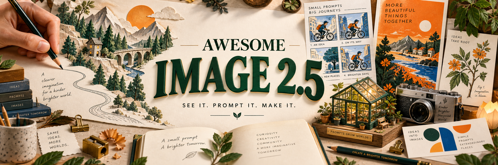

<h1 align="center">Awesome Image 2.5</h1>

<strong>Find an image you love. Read its prompt. Make it your own.</strong>

<a href="README.md">中文</a> · <a href="README.en.md">English</a>

  

<a href="#start-here">Start here</a> · <a href="#gallery-index">All categories</a> · <a href="#installation">Install & use</a> · <a href="docs/workflows.md">Editing workflows</a> · <a href="CONTRIBUTING.md">Contribute</a>

**31 creative categories · image examples with sources · 2 Agent Skills · generation & editing CLI**

| 🖼️ Find a visual direction | 📝 Get a usable prompt | 🛠️ Create with an agent |
| --- | --- | --- |
| [Browse all categories](#gallery-index) | [Open the prompt atlas](skills/image25/references/gallery.md) | [Install a Skill](#installation) |

## Start with a complete example

Open an image to read the full prompt, adaptation notes and observed limitations. These original demonstrations have no exact model ID from the host.

<table>
<tr>
<td width="50%" align="center" valign="top"> <strong>Chinese poster · exact text</strong> <a href="skills/image25/references/showcase/tea-campaign.md">Prompt & walkthrough</a></td>
<td width="50%" align="center" valign="top"> <strong>Workspace UI · clear layout</strong> <a href="skills/image25/references/showcase/field-notes-ui.md">Prompt & walkthrough</a></td>
</tr>
<tr>
<td width="50%" align="center" valign="top"> <strong>Packaging · consistent series</strong> <a href="skills/image25/references/showcase/coffee-packaging.md">Prompt & walkthrough</a></td>
<td width="50%" align="center" valign="top"> <strong>Character sheet · three views</strong> <a href="skills/image25/references/showcase/courier-character.md">Prompt & walkthrough</a></td>
</tr>
</table>

[Explore Image 2.5 source examples →](docs/image25/README.md)

**New here?** [How to use the prompts](docs/prompts.md) · [Documentation map](docs/README.md) · [FAQ](docs/troubleshooting.md). Supporting guides and original case titles are currently primarily in Chinese; prompt blocks can be reused directly.

## Selected prompt gallery

Jump to a section or open its full Markdown atlas. Each category separates source images, original demonstrations and legacy references.

<table>
<tr>
<td align="center" width="33%"><strong><a href="#gallery-anime-and-manga">Anime And Manga</a></strong> <a href="skills/image25/references/gallery-anime-and-manga.md">All cases & prompts</a></td>
<td align="center" width="33%"><strong><a href="#gallery-gaming">Gaming</a></strong> <a href="skills/image25/references/gallery-gaming.md">All cases & prompts</a></td>
<td align="center" width="33%"><strong><a href="#gallery-retro-and-cyberpunk">Retro And Cyberpunk</a></strong> <a href="skills/image25/references/gallery-retro-and-cyberpunk.md">All cases & prompts</a></td>
</tr>
<tr>
<td align="center" width="33%"><strong><a href="#gallery-cinematic-and-animation">Cinematic And Animation</a></strong> <a href="skills/image25/references/gallery-cinematic-and-animation.md">All cases & prompts</a></td>
<td align="center" width="33%"><strong><a href="#gallery-character-design">Character Design</a></strong> <a href="skills/image25/references/gallery-character-design.md">All cases & prompts</a></td>
<td align="center" width="33%"><strong><a href="#gallery-typography-and-posters">Typography And Posters</a></strong> <a href="skills/image25/references/gallery-typography-and-posters.md">All cases & prompts</a></td>
</tr>
<tr>
<td align="center" width="33%"><strong><a href="#gallery-illustration">Illustration</a></strong> <a href="skills/image25/references/gallery-illustration.md">All cases & prompts</a></td>
<td align="center" width="33%"><strong><a href="#gallery-watercolor">Watercolor</a></strong> <a href="skills/image25/references/gallery-watercolor.md">All cases & prompts</a></td>
<td align="center" width="33%"><strong><a href="#gallery-ink-and-chinese">Ink And Chinese</a></strong> <a href="skills/image25/references/gallery-ink-and-chinese.md">All cases & prompts</a></td>
</tr>
<tr>
<td align="center" width="33%"><strong><a href="#gallery-pixel-art">Pixel Art</a></strong> <a href="skills/image25/references/gallery-pixel-art.md">All cases & prompts</a></td>
<td align="center" width="33%"><strong><a href="#gallery-isometric">Isometric</a></strong> <a href="skills/image25/references/gallery-isometric.md">All cases & prompts</a></td>
<td align="center" width="33%"><strong><a href="#gallery-product-and-food">Product And Food</a></strong> <a href="skills/image25/references/gallery-product-and-food.md">All cases & prompts</a></td>
</tr>
<tr>
<td align="center" width="33%"><strong><a href="#gallery-brand-systems-and-identity">Brand Systems And Identity</a></strong> <a href="skills/image25/references/gallery-brand-systems-and-identity.md">All cases & prompts</a></td>
<td align="center" width="33%"><strong><a href="#gallery-photography">Photography</a></strong> <a href="skills/image25/references/gallery-photography.md">All cases & prompts</a></td>
<td align="center" width="33%"><strong><a href="#gallery-screen-photography">Screen Photography</a></strong> <a href="skills/image25/references/gallery-screen-photography.md">All cases & prompts</a></td>
</tr>
<tr>
<td align="center" width="33%"><strong><a href="#gallery-infographics-and-field-guides">Infographics And Field Guides</a></strong> <a href="skills/image25/references/gallery-infographics-and-field-guides.md">All cases & prompts</a></td>
<td align="center" width="33%"><strong><a href="#gallery-research-paper-figures">Research Paper Figures</a></strong> <a href="skills/image25/references/gallery-research-paper-figures.md">All cases & prompts</a></td>
<td align="center" width="33%"><strong><a href="#gallery-official-openai-cookbook-examples">Official Openai Cookbook Examples</a></strong> <a href="skills/image25/references/gallery-official-openai-cookbook-examples.md">All cases & prompts</a></td>
</tr>
<tr>
<td align="center" width="33%"><strong><a href="#gallery-edit-endpoint-showcase">Edit Endpoint Showcase</a></strong> <a href="skills/image25/references/gallery-edit-endpoint-showcase.md">All cases & prompts</a></td>
<td align="center" width="33%"><strong><a href="#gallery-ui-ux-mockups">Ui Ux Mockups</a></strong> <a href="skills/image25/references/gallery-ui-ux-mockups.md">All cases & prompts</a></td>
<td align="center" width="33%"><strong><a href="#gallery-data-visualization">Data Visualization</a></strong> <a href="skills/image25/references/gallery-data-visualization.md">All cases & prompts</a></td>
</tr>
<tr>
<td align="center" width="33%"><strong><a href="#gallery-technical-illustration">Technical Illustration</a></strong> <a href="skills/image25/references/gallery-technical-illustration.md">All cases & prompts</a></td>
<td align="center" width="33%"><strong><a href="#gallery-architecture-and-interior">Architecture And Interior</a></strong> <a href="skills/image25/references/gallery-architecture-and-interior.md">All cases & prompts</a></td>
<td align="center" width="33%"><strong><a href="#gallery-scientific-and-educational">Scientific And Educational</a></strong> <a href="skills/image25/references/gallery-scientific-and-educational.md">All cases & prompts</a></td>
</tr>
<tr>
<td align="center" width="33%"><strong><a href="#gallery-fashion-editorial">Fashion Editorial</a></strong> <a href="skills/image25/references/gallery-fashion-editorial.md">All cases & prompts</a></td>
<td align="center" width="33%"><strong><a href="#gallery-fine-art-painting">Fine Art Painting</a></strong> <a href="skills/image25/references/gallery-fine-art-painting.md">All cases & prompts</a></td>
<td align="center" width="33%"><strong><a href="#gallery-more-illustration-styles">More Illustration Styles</a></strong> <a href="skills/image25/references/gallery-more-illustration-styles.md">All cases & prompts</a></td>
</tr>
<tr>
<td align="center" width="33%"><strong><a href="#gallery-cinematic-film-references">Cinematic Film References</a></strong> <a href="skills/image25/references/gallery-cinematic-film-references.md">All cases & prompts</a></td>
<td align="center" width="33%"><strong><a href="#gallery-beauty-and-lifestyle">Beauty And Lifestyle</a></strong> <a href="skills/image25/references/gallery-beauty-and-lifestyle.md">All cases & prompts</a></td>
<td align="center" width="33%"><strong><a href="#gallery-events-and-experience">Events And Experience</a></strong> <a href="skills/image25/references/gallery-events-and-experience.md">All cases & prompts</a></td>
</tr>
<tr>
<td align="center" width="33%"><strong><a href="#gallery-tattoo-design">Tattoo Design</a></strong> <a href="skills/image25/references/gallery-tattoo-design.md">All cases & prompts</a></td>
</tr>
</table>

<h2 align="center">Anime And Manga</h2>

[↑ Index](#gallery-index) · [Full category](skills/image25/references/gallery-anime-and-manga.md)

**Image 2.5: 6 · host-model-unknown: 0 · GPT Image 2: 12**

Define character identity, camera direction, action and panel reading order. Check hair, costume, accessories and continuity across panels.

<table>
<tr>
<td width="50%" align="center" valign="top"> <strong>动漫贴纸集合</strong> Image 2.5 · Community author claim · LaplaceYoung</td>
<td width="50%" align="center" valign="top"> <strong>讽刺漫画生成</strong> Image 2.5 · Community author claim · LaplaceYoung</td>
</tr>
</table>

Prompt · 动漫贴纸集合

[LaplaceYoung · Original source](https://github.com/LaplaceYoung/awesome-gpt-image-2.5/blob/9bb515b6b978a7521ae884821a847ab58c11c939/docs/cases/071-imported-.md) · **Image 2.5 · Community author claim**

[Author prompt & generation conditions](https://github.com/LaplaceYoung/awesome-gpt-image-2.5/blob/9bb515b6b978a7521ae884821a847ab58c11c939/docs/cases/071-imported-.md)

The full prompt is not reproduced here. Undisclosed settings remain unknown.

Prompt · 讽刺漫画生成

[LaplaceYoung · Original source](https://github.com/LaplaceYoung/awesome-gpt-image-2.5/blob/9bb515b6b978a7521ae884821a847ab58c11c939/docs/cases/081-imported-.md) · **Image 2.5 · Community author claim**

[Author prompt & generation conditions](https://github.com/LaplaceYoung/awesome-gpt-image-2.5/blob/9bb515b6b978a7521ae884821a847ab58c11c939/docs/cases/081-imported-.md)

The full prompt is not reproduced here. Undisclosed settings remain unknown.

Adaptable practice prompt

**prompt-only** · Written for this project; not yet rendered and not the original prompt for the images above.

~~~text
Create a two-page monochrome manga spread about an original bicycle courier caught in a sudden rainstorm. Use six panels in a clear left-to-right reading order, with one wide establishing panel, three action beats and two close-ups. Keep the courier's short hair, round glasses and yellow rain cape consistent. Use varied ink line weights and restrained screentone. Keep speech balloons empty for later lettering. Preserve clear gutters and readable silhouettes.
~~~

<h2 align="center">Gaming</h2>

[↑ Index](#gallery-index) · [Full category](skills/image25/references/gallery-gaming.md)

**Image 2.5: 4 · host-model-unknown: 0 · GPT Image 2: 10**

Specify the player viewpoint, level layout, HUD grid and readability. Match minimaps and health bars to the scene, and distinguish gameplay from promotional art.

<table>
<tr>
<td width="50%" align="center" valign="top"> <strong>超写实3D游戏角色怀旧场景</strong> Image 2.5 · Community author claim · LaplaceYoung</td>
<td width="50%" align="center" valign="top"> <strong>RPG 风格角色卡片制作</strong> Image 2.5 · Community author claim · LaplaceYoung</td>
</tr>
</table>

Prompt · 超写实3D游戏角色怀旧场景

[LaplaceYoung · Original source](https://github.com/LaplaceYoung/awesome-gpt-image-2.5/blob/9bb515b6b978a7521ae884821a847ab58c11c939/docs/cases/040-imported-3d.md) · **Image 2.5 · Community author claim**

[Author prompt & generation conditions](https://github.com/LaplaceYoung/awesome-gpt-image-2.5/blob/9bb515b6b978a7521ae884821a847ab58c11c939/docs/cases/040-imported-3d.md)

The full prompt is not reproduced here. Undisclosed settings remain unknown.

Prompt · RPG 风格角色卡片制作

[LaplaceYoung · Original source](https://github.com/LaplaceYoung/awesome-gpt-image-2.5/blob/9bb515b6b978a7521ae884821a847ab58c11c939/docs/cases/062-imported-rpg.md) · **Image 2.5 · Community author claim**

[Author prompt & generation conditions](https://github.com/LaplaceYoung/awesome-gpt-image-2.5/blob/9bb515b6b978a7521ae884821a847ab58c11c939/docs/cases/062-imported-rpg.md)

The full prompt is not reproduced here. Undisclosed settings remain unknown.

Adaptable practice prompt

**prompt-only** · Written for this project; not yet rendered and not the original prompt for the images above.

~~~text
Create a 16:9 screenshot concept for an original third-person exploration game set in a flooded observatory. Place the player in the lower left looking toward a lit doorway. Reserve the lower right for three ability icons, the upper left for health and the upper right for a small map. Use consistent icon weights and generous spacing. Keep enemies and the traversal route visible; interface elements must not cover the character or objective.
~~~

<h2 align="center">Retro And Cyberpunk</h2>

[↑ Index](#gallery-index) · [Full category](skills/image25/references/gallery-retro-and-cyberpunk.md)

**Image 2.5: 6 · host-model-unknown: 0 · GPT Image 2: 3**

Choose a technological era, city structure, materials and color hierarchy. Keep objects consistent with the setting; neon alone does not define the style.

<table>
<tr>
<td width="50%" align="center" valign="top"> <strong>复古未来城市</strong> Image 2.5 · Official sample · OpenAI</td>
<td width="50%" align="center" valign="top"> <strong>赛博朋克城市</strong> Image 2.5 · Official sample · OpenAI</td>
</tr>
</table>

Prompt · 复古未来城市

[OpenAI · Original source](https://openai.com/index/introducing-chatgpt-images-2-5/) · **Image 2.5 · Official sample**

[Author prompt & generation conditions](https://openai.com/index/introducing-chatgpt-images-2-5/)

The full prompt is not reproduced here. Undisclosed settings remain unknown.

Prompt · 赛博朋克城市

[OpenAI · Original source](https://openai.com/index/introducing-chatgpt-images-2-5/) · **Image 2.5 · Official sample**

[Author prompt & generation conditions](https://openai.com/index/introducing-chatgpt-images-2-5/)

The full prompt is not reproduced here. Undisclosed settings remain unknown.

Adaptable practice prompt

**prompt-only** · Written for this project; not yet rendered and not the original prompt for the images above.

~~~text
Create a 16:9 concept board for an original retro-futurist harbor city. Divide it into a large street scene on the left and three stacked detail studies on the right: public phone, transit ticket and raincoat. Use rounded analog controls, enamel signs, copper wiring and weathered glass. Restrict light accents to amber and cyan against charcoal architecture. Repeat the same visual language in all four regions. No borrowed franchise logos or unreadable decorative lettering.
~~~

<h2 align="center">Cinematic And Animation</h2>

[↑ Index](#gallery-index) · [Full category](skills/image25/references/gallery-cinematic-and-animation.md)

**Image 2.5: 5 · host-model-unknown: 0 · GPT Image 2: 5**

Describe camera language, character continuity, time of day and lighting. Check eyelines, props and action between shots.

<table>
<tr>
<td width="50%" align="center" valign="top"> <strong>Q版求婚场景</strong> Image 2.5 · Community author claim · LaplaceYoung</td>
<td width="50%" align="center" valign="top"> <strong>3D Q版风格场景</strong> Image 2.5 · Community author claim · LaplaceYoung</td>
</tr>
</table>

Prompt · Q版求婚场景

[LaplaceYoung · Original source](https://github.com/LaplaceYoung/awesome-gpt-image-2.5/blob/9bb515b6b978a7521ae884821a847ab58c11c939/docs/cases/085-imported-q.md) · **Image 2.5 · Community author claim**

[Author prompt & generation conditions](https://github.com/LaplaceYoung/awesome-gpt-image-2.5/blob/9bb515b6b978a7521ae884821a847ab58c11c939/docs/cases/085-imported-q.md)

The full prompt is not reproduced here. Undisclosed settings remain unknown.

Prompt · 3D Q版风格场景

[LaplaceYoung · Original source](https://github.com/LaplaceYoung/awesome-gpt-image-2.5/blob/9bb515b6b978a7521ae884821a847ab58c11c939/docs/cases/087-imported-3d-q.md) · **Image 2.5 · Community author claim**

[Author prompt & generation conditions](https://github.com/LaplaceYoung/awesome-gpt-image-2.5/blob/9bb515b6b978a7521ae884821a847ab58c11c939/docs/cases/087-imported-3d-q.md)

The full prompt is not reproduced here. Undisclosed settings remain unknown.

Adaptable practice prompt

**prompt-only** · Written for this project; not yet rendered and not the original prompt for the images above.

~~~text
Create a six-panel storyboard in a 3 by 2 landscape grid for an original short film: a night-shift baker discovers a small bird in the shop. Show exterior, doorway, medium interaction, hand close-up, reverse angle and final wide shot. Keep the same apron, counter and warm window light in every panel. Use readable pencil-and-marker drawings, equal gutters and small panel numbers 1 through 6. Preserve screen direction and leave captions empty.
~~~

<h2 align="center">Character Design</h2>

[↑ Index](#gallery-index) · [Full category](skills/image25/references/gallery-character-design.md)

**Image 2.5: 8 · host-model-unknown: 1 · GPT Image 2: 2**

Set silhouette, proportions, costume construction and view alignment. Compare accessory placement, handedness and proportions across views.

<table>
<tr>
<td width="50%" align="center" valign="top"> <strong>角色三视图</strong> Image 2.5 · Provider claim · ReelyArt</td>
<td width="50%" align="center" valign="top"> <strong>3D Q版大学拟人化形象</strong> Image 2.5 · Community author claim · LaplaceYoung</td>
</tr>
</table>

Prompt · 角色三视图

[ReelyArt · Original source](https://reely.art/models/gpt-image-2-5-sunburst) · **Image 2.5 · Provider claim**

[Author prompt & generation conditions](https://reely.art/models/gpt-image-2-5-sunburst)

The full prompt is not reproduced here. Undisclosed settings remain unknown.

Prompt · 3D Q版大学拟人化形象

[LaplaceYoung · Original source](https://github.com/LaplaceYoung/awesome-gpt-image-2.5/blob/9bb515b6b978a7521ae884821a847ab58c11c939/docs/cases/061-imported-3d-q.md) · **Image 2.5 · Community author claim**

[Author prompt & generation conditions](https://github.com/LaplaceYoung/awesome-gpt-image-2.5/blob/9bb515b6b978a7521ae884821a847ab58c11c939/docs/cases/061-imported-3d-q.md)

The full prompt is not reproduced here. Undisclosed settings remain unknown.

Adaptable practice prompt

**prompt-only** · Written for this project; not yet rendered and not the original prompt for the images above.

~~~text
Create a character reference sheet for an original mountain postal worker. Arrange front, side and back orthographic views on one shared baseline, with four small facial expressions underneath. The worker has a short navy jacket, orange scarf, square canvas satchel and sturdy boots. Preserve exact garment construction, body proportions and the satchel's side in every view. Use clean linework and flat color, a pale background and no dramatic perspective.
~~~

<h2 align="center">Typography And Posters</h2>

[↑ Index](#gallery-index) · [Full category](skills/image25/references/gallery-typography-and-posters.md)

**Image 2.5: 18 · host-model-unknown: 1 · GPT Image 2: 13**

Specify copy hierarchy, grid, negative space, hero image and typography. Check titles, dates and prices character by character; remove invented text.

<table>
<tr>
<td width="50%" align="center" valign="top"> <strong>现代主义海报组</strong> Image 2.5 · Official sample · OpenAI</td>
<td width="50%" align="center" valign="top"> <strong>展览文字海报</strong> Image 2.5 · Provider claim · ReelyArt</td>
</tr>
</table>

Prompt · 现代主义海报组

[OpenAI · Original source](https://openai.com/index/introducing-chatgpt-images-2-5/) · **Image 2.5 · Official sample**

[Author prompt & generation conditions](https://openai.com/index/introducing-chatgpt-images-2-5/)

The full prompt is not reproduced here. Undisclosed settings remain unknown.

Prompt · 展览文字海报

[ReelyArt · Original source](https://reely.art/models/gpt-image-2-5-sunburst) · **Image 2.5 · Provider claim**

[Author prompt & generation conditions](https://reely.art/models/gpt-image-2-5-sunburst)

The full prompt is not reproduced here. Undisclosed settings remain unknown.

Adaptable practice prompt

**prompt-only** · Written for this project; not yet rendered and not the original prompt for the images above.

~~~text
Design a 3:4 exhibition poster on warm ivory paper. Set the exact title "夜间植物馆" in large dark-green type across the upper third. Place a single cyanotype fern image in the middle, with generous negative space. At the bottom, align the exact text "NIGHT BOTANICALS" and "09.18 — 10.12" on a strict two-column grid. Use one small vermilion accent. Keep all text legible, without extra slogans or invented sponsor logos.
~~~

<h2 align="center">Illustration</h2>

[↑ Index](#gallery-index) · [Full category](skills/image25/references/gallery-illustration.md)

**Image 2.5: 6 · host-model-unknown: 1 · GPT Image 2: 2**

Describe the narrative action, subject relationships, layers and medium. Check that the story reads clearly and the intended illustration technique is preserved.

<table>
<tr>
<td width="50%" align="center" valign="top"> <strong>节日主题系列</strong> Image 2.5 · X author claim · @BlackthorneAI</td>
<td width="50%" align="center" valign="top"> <strong>超现实交互场景</strong> Image 2.5 · Community author claim · LaplaceYoung</td>
</tr>
</table>

Prompt · 节日主题系列

[@BlackthorneAI · Original source](https://x.com/BlackthorneAI/status/2097447432757887207) · **Image 2.5 · X author claim**

[Author prompt & generation conditions](https://x.com/BlackthorneAI/status/2097447432757887207)

The full prompt is not reproduced here. Undisclosed settings remain unknown.

Prompt · 超现实交互场景

[LaplaceYoung · Original source](https://github.com/LaplaceYoung/awesome-gpt-image-2.5/blob/9bb515b6b978a7521ae884821a847ab58c11c939/docs/cases/028-imported-.md) · **Image 2.5 · Community author claim**

[Author prompt & generation conditions](https://github.com/LaplaceYoung/awesome-gpt-image-2.5/blob/9bb515b6b978a7521ae884821a847ab58c11c939/docs/cases/028-imported-.md)

The full prompt is not reproduced here. Undisclosed settings remain unknown.

Adaptable practice prompt

**prompt-only** · Written for this project; not yet rendered and not the original prompt for the images above.

~~~text
Create a landscape editorial illustration of a librarian delivering a book to a tiny rooftop garden. Put the librarian on the right and a waiting child on the left, connected by the passing book. Use layered cut-paper shapes, visible fiber edges, a limited moss-green and coral palette, and soft overlapping shadows. Let rooftop geometry establish depth. Keep the scene legible at thumbnail size and reserve clear space in the upper left for a headline.
~~~

<h2 align="center">Watercolor</h2>

[↑ Index](#gallery-index) · [Full category](skills/image25/references/gallery-watercolor.md)

**Image 2.5: 1 · host-model-unknown: 0 · GPT Image 2: 2**

Describe transparent washes, paper whites, wet edges and pigment granulation. Preserve natural edge variation rather than uniform blur or plastic highlights.

<table>
<tr>
<td width="50%" align="center" valign="top"> <strong>富士山水彩风格转换</strong> Image 2.5 · Community author claim · LaplaceYoung</td>
</tr>
</table>

Prompt · 富士山水彩风格转换

[LaplaceYoung · Original source](https://github.com/LaplaceYoung/awesome-gpt-image-2.5/blob/9bb515b6b978a7521ae884821a847ab58c11c939/docs/cases/109-imported-.md) · **Image 2.5 · Community author claim**

[Author prompt & generation conditions](https://github.com/LaplaceYoung/awesome-gpt-image-2.5/blob/9bb515b6b978a7521ae884821a847ab58c11c939/docs/cases/109-imported-.md)

The full prompt is not reproduced here. Undisclosed settings remain unknown.

Adaptable practice prompt

**prompt-only** · Written for this project; not yet rendered and not the original prompt for the images above.

~~~text
Paint a quiet greenhouse after rain as a transparent watercolor illustration. Use a landscape frame with a stone path leading toward a small open door. Leave paper white for wet leaves and window reflections. Combine soft wet-on-wet foliage with a few crisp dry-brush edges on pots. Use granulating ultramarine shadows and diluted yellow-green washes. Keep pencil construction faintly visible; avoid photographic sharpness, heavy oil impasto and glossy 3D surfaces.
~~~

<h2 align="center">Ink And Chinese</h2>

[↑ Index](#gallery-index) · [Full category](skills/image25/references/gallery-ink-and-chinese.md)

**Image 2.5: 0 · host-model-unknown: 0 · GPT Image 2: 2**

Specify shifting perspective, ink density, negative space and inscriptions. Provide exact text and placement; check for invented characters.

> No Image 2.5 source image is assigned here yet. Each example below retains its actual model status.

<table>
<tr>
<td width="50%" align="center" valign="top"> <strong>Chinese ink-wash mountain landscape</strong> GPT Image 2 · legacy reference · Wuyoscar / authors credited on the source page</td>
<td width="50%" align="center" valign="top"> <strong>Song dynasty night-market handscroll</strong> GPT Image 2 · legacy reference · Wuyoscar / authors credited on the source page</td>
</tr>
</table>

Prompt · Chinese ink-wash mountain landscape

[Wuyoscar / authors credited on the source page · Original source](https://github.com/wuyoscar/GPT-Image2-Skill/blob/135d873e1a843db5f122a15ddda02bd2845d4d25/skills/gpt-image/references/gallery-ink-and-chinese.md) · **GPT Image 2 · legacy reference**

Metadata: Ink & Chinese · `portrait` · `1024x1536` · Author: EvoLinkAI · Source: [GitHub archive](https://github.com/EvoLinkAI/awesome-gpt-image-2-prompts)

~~~text
A traditional Chinese ink-wash (水墨) landscape painting of mist-shrouded mountains, rendered on aged xuan rice paper. Layered mountain ranges receding into distance through gradations of black ink — bold dark foreground peaks with sharp brushwork, mid-ground ranges in medium wash, far peaks almost dissolved into pale grey mist. A single traditional pavilion perched on a cliff midway up, a small solitary figure crossing a wooden bridge over a waterfall. Pine trees with calligraphic branches, curling cloud-mist flowing between peaks (留白 negative-space clouds). A vertical seal stamp in red (篆刻 zhu-wen style) bottom-left, a vertical column of calligraphic characters reading "山高水長" top-right in elegant caoshu (草書) brushwork. Paper has faint warm beige tone with visible fiber texture. Aesthetic in the tradition of 范寬 Fan Kuan / 馬遠 Ma Yuan Song-dynasty landscape painting — contemplative, restrained, deep negative space, brush-energy (气韵) visible in every stroke.
~~~

Prompt · Song dynasty night-market handscroll

[Wuyoscar / authors credited on the source page · Original source](https://github.com/wuyoscar/GPT-Image2-Skill/blob/135d873e1a843db5f122a15ddda02bd2845d4d25/skills/gpt-image/references/gallery-ink-and-chinese.md) · **GPT Image 2 · legacy reference**

Metadata: Ink & Chinese · `landscape` · `1536x1024` · Curated

~~~text
Create a horizontal Chinese ink-and-wash handscroll scene of a Song dynasty riverside night market. Use gongbi-level architectural detail combined with loose ink atmosphere: arched stone bridge, lantern boats, teahouse balconies, book stalls, noodle steam, scholars reading under lamps, children chasing paper rabbits, and distant city walls fading into mist. Add small readable Chinese shop signs in brush style: "茶", "书", "面", "灯市". Palette: black ink, warm lantern ochre, muted cinnabar seals, and pale blue-gray moonlight. Composition should read as a continuous scroll with rhythmic clusters of people and negative-space water. Avoid modern objects, anime faces, fake calligraphy clutter, and overly saturated poster lighting.
~~~

Adaptable practice prompt

**prompt-only** · Written for this project; not yet rendered and not the original prompt for the images above.

~~~text
Create a long horizontal ink-and-light-color landscape on warm rice paper. Show a river ferry approaching a village beneath distant mountains. Build depth with three overlapping layers, progressively lighter ink and generous untouched paper for mist. Use dry-brush texture for roof tiles and sparse cinnabar accents on lanterns. Reserve a small blank inscription area at the upper right. Keep the brushwork varied and avoid photographic perspective or decorative fake calligraphy.
~~~

<h2 align="center">Pixel Art</h2>

[↑ Index](#gallery-index) · [Full category](skills/image25/references/gallery-pixel-art.md)

**Image 2.5: 2 · host-model-unknown: 0 · GPT Image 2: 2**

Set a logical resolution, palette, pixel clusters and frames. Keep pixel scale consistent and avoid smooth gradients or interpolated edges.

<table>
<tr>
<td width="50%" align="center" valign="top"> <strong>8位像素图标</strong> Image 2.5 · Community author claim · LaplaceYoung</td>
<td width="50%" align="center" valign="top"> <strong>体素风格 3D 图标</strong> Image 2.5 · Community author claim · LaplaceYoung</td>
</tr>
</table>

Prompt · 8位像素图标

[LaplaceYoung · Original source](https://github.com/LaplaceYoung/awesome-gpt-image-2.5/blob/9bb515b6b978a7521ae884821a847ab58c11c939/docs/cases/049-imported-8.md) · **Image 2.5 · Community author claim**

[Author prompt & generation conditions](https://github.com/LaplaceYoung/awesome-gpt-image-2.5/blob/9bb515b6b978a7521ae884821a847ab58c11c939/docs/cases/049-imported-8.md)

The full prompt is not reproduced here. Undisclosed settings remain unknown.

Prompt · 体素风格 3D 图标

[LaplaceYoung · Original source](https://github.com/LaplaceYoung/awesome-gpt-image-2.5/blob/9bb515b6b978a7521ae884821a847ab58c11c939/docs/cases/058-imported-3d.md) · **Image 2.5 · Community author claim**

[Author prompt & generation conditions](https://github.com/LaplaceYoung/awesome-gpt-image-2.5/blob/9bb515b6b978a7521ae884821a847ab58c11c939/docs/cases/058-imported-3d.md)

The full prompt is not reproduced here. Undisclosed settings remain unknown.

Adaptable practice prompt

**prompt-only** · Written for this project; not yet rendered and not the original prompt for the images above.

~~~text
Create a pixel-art sprite sheet of an original delivery bicycle in eight directional views. Arrange the views in a 4 by 2 grid with equal 64 by 64 logical-pixel cells and consistent wheel size. Use a restricted sixteen-color palette, crisp nearest-neighbor edges and deliberate pixel clusters. Center every sprite on its cell baseline. Keep the background a flat light gray and avoid antialiasing, blur and continuous gradients.
~~~

<h2 align="center">Isometric</h2>

[↑ Index](#gallery-index) · [Full category](skills/image25/references/gallery-isometric.md)

**Image 2.5: 6 · host-model-unknown: 1 · GPT Image 2: 2**

Fix the axes, proportions, materials and spatial layout. Parallel lines should stay parallel; check floors, passages and object scale.

<table>
<tr>
<td width="50%" align="center" valign="top"> <strong>等距建筑剖面</strong> Image 2.5 · Provider claim · ReelyArt</td>
<td width="50%" align="center" valign="top"> <strong>乐高城市景观</strong> Image 2.5 · Community author claim · LaplaceYoung</td>
</tr>
</table>

Prompt · 等距建筑剖面

[ReelyArt · Original source](https://reely.art/models/gpt-image-2-5-sunburst) · **Image 2.5 · Provider claim**

[Author prompt & generation conditions](https://reely.art/models/gpt-image-2-5-sunburst)

The full prompt is not reproduced here. Undisclosed settings remain unknown.

Prompt · 乐高城市景观

[LaplaceYoung · Original source](https://github.com/LaplaceYoung/awesome-gpt-image-2.5/blob/9bb515b6b978a7521ae884821a847ab58c11c939/docs/cases/033-imported-.md) · **Image 2.5 · Community author claim**

[Author prompt & generation conditions](https://github.com/LaplaceYoung/awesome-gpt-image-2.5/blob/9bb515b6b978a7521ae884821a847ab58c11c939/docs/cases/033-imported-.md)

The full prompt is not reproduced here. Undisclosed settings remain unknown.

Adaptable practice prompt

**prompt-only** · Written for this project; not yet rendered and not the original prompt for the images above.

~~~text
Create an isometric cutaway of a two-story neighborhood tea shop on a square canvas. Use consistent parallel axes and a fixed elevated view. The ground floor contains a counter, brewing station and four seats; the upper floor contains a small reading room reached by a visible staircase. Use warm wood, pale plaster and restrained green details. Keep walls cut away cleanly and furniture at a consistent scale, with no impossible connections.
~~~

<h2 align="center">Product And Food</h2>

[↑ Index](#gallery-index) · [Full category](skills/image25/references/gallery-product-and-food.md)

**Image 2.5: 13 · host-model-unknown: 2 · GPT Image 2: 4**

Describe product geometry, materials, lighting, contact shadows and food condition. Check labels, vessel structure, gravity and food texture.

<table>
<tr>
<td width="50%" align="center" valign="top"> <strong>陶瓷收纳器</strong> Image 2.5 · Provider claim · ReelyArt</td>
<td width="50%" align="center" valign="top"> <strong>实物与手绘涂鸦创意广告</strong> Image 2.5 · Community author claim · LaplaceYoung</td>
</tr>
</table>

Prompt · 陶瓷收纳器

[ReelyArt · Original source](https://reely.art/models/gpt-image-2-5-sunburst) · **Image 2.5 · Provider claim**

[Author prompt & generation conditions](https://reely.art/models/gpt-image-2-5-sunburst)

The full prompt is not reproduced here. Undisclosed settings remain unknown.

Prompt · 实物与手绘涂鸦创意广告

[LaplaceYoung · Original source](https://github.com/LaplaceYoung/awesome-gpt-image-2.5/blob/9bb515b6b978a7521ae884821a847ab58c11c939/docs/cases/019-imported-.md) · **Image 2.5 · Community author claim**

[Author prompt & generation conditions](https://github.com/LaplaceYoung/awesome-gpt-image-2.5/blob/9bb515b6b978a7521ae884821a847ab58c11c939/docs/cases/019-imported-.md)

The full prompt is not reproduced here. Undisclosed settings remain unknown.

Adaptable practice prompt

**prompt-only** · Written for this project; not yet rendered and not the original prompt for the images above.

~~~text
Create a 3:4 studio product photograph of a fictional ceramic tea canister with a cream paper label reading exactly "MORNING LEAF". Place it at a slight three-quarter angle on a pale stone plinth, with two loose tea leaves nearby. Use a large soft key light from the left, a subtle dark reflection on the right and a grounded contact shadow. Preserve realistic ceramic roughness and paper texture. No floating lid, extra labels or unrelated props.
~~~

<h2 align="center">Brand Systems And Identity</h2>

[↑ Index](#gallery-index) · [Full category](skills/image25/references/gallery-brand-systems-and-identity.md)

**Image 2.5: 9 · host-model-unknown: 1 · GPT Image 2: 3**

Define a shared logo, palette, type system and layout. Keep the mark, brand colors and text hierarchy consistent across applications.

<table>
<tr>
<td width="50%" align="center" valign="top"> <strong>国家公园邮票</strong> Image 2.5 · Official sample · OpenAI</td>
<td width="50%" align="center" valign="top"> <strong>贴纸设计</strong> Image 2.5 · Official sample · OpenAI</td>
</tr>
</table>

Prompt · 国家公园邮票

[OpenAI · Original source](https://openai.com/index/introducing-chatgpt-images-2-5/) · **Image 2.5 · Official sample**

[Author prompt & generation conditions](https://openai.com/index/introducing-chatgpt-images-2-5/)

The full prompt is not reproduced here. Undisclosed settings remain unknown.

Prompt · 贴纸设计

[OpenAI · Original source](https://openai.com/index/introducing-chatgpt-images-2-5/) · **Image 2.5 · Official sample**

[Author prompt & generation conditions](https://openai.com/index/introducing-chatgpt-images-2-5/)

The full prompt is not reproduced here. Undisclosed settings remain unknown.

Adaptable practice prompt

**prompt-only** · Written for this project; not yet rendered and not the original prompt for the images above.

~~~text
Create a square identity board for a fictional neighborhood bakery called "NORTH CRUMB". Use a modular grid containing a wordmark, three color swatches, a paper bag, a business card and one social announcement. Repeat the same rounded lettering, navy-and-butter palette and wheat motif across all applications. Keep packaging folds realistic and text sparse. Make the logo shape consistent at every scale; avoid unrelated mockups or additional brand names.
~~~

<h2 align="center">Photography</h2>

[↑ Index](#gallery-index) · [Full category](skills/image25/references/gallery-photography.md)

**Image 2.5: 18 · host-model-unknown: 1 · GPT Image 2: 4**

Describe viewpoint, depth of field, spatial geometry and natural details. Check skin and reflections; do not infer actual camera metadata from appearance.

<table>
<tr>
<td width="50%" align="center" valign="top"> <strong>八十年代肖像</strong> Image 2.5 · Official sample · OpenAI</td>
<td width="50%" align="center" valign="top"> <strong>夜间工作室</strong> Image 2.5 · Provider claim · ReelyArt</td>
</tr>
</table>

Prompt · 八十年代肖像

[OpenAI · Original source](https://openai.com/index/introducing-chatgpt-images-2-5/) · **Image 2.5 · Official sample**

[Author prompt & generation conditions](https://openai.com/index/introducing-chatgpt-images-2-5/)

The full prompt is not reproduced here. Undisclosed settings remain unknown.

Prompt · 夜间工作室

[ReelyArt · Original source](https://reely.art/models/gpt-image-2-5-sunburst) · **Image 2.5 · Provider claim**

[Author prompt & generation conditions](https://reely.art/models/gpt-image-2-5-sunburst)

The full prompt is not reproduced here. Undisclosed settings remain unknown.

Adaptable practice prompt

**prompt-only** · Written for this project; not yet rendered and not the original prompt for the images above.

~~~text
Create an environmental portrait of an adult bookbinder beside a workshop window on an overcast morning. Frame from the waist up, with the person slightly right of center and a workbench in the foreground. Use soft side light, natural skin texture, gently compressed perspective and a modest depth of field that keeps the tools recognizable. Include worn linen, paper dust and small hand imperfections. Avoid beauty-filter skin and overly cinematic neon lighting.
~~~

<h2 align="center">Screen Photography</h2>

[↑ Index](#gallery-index) · [Full category](skills/image25/references/gallery-screen-photography.md)

**Image 2.5: 3 · host-model-unknown: 0 · GPT Image 2: 2**

Specify the physical device, camera angle, reflections and screen content. Distinguish a screen photograph from a flat screenshot and align their perspectives.

<table>
<tr>
<td width="50%" align="center" valign="top"> <strong>显示器界面样机</strong> Image 2.5 · Provider claim · ReelyArt</td>
<td width="50%" align="center" valign="top"> <strong>手机屏幕文字</strong> Image 2.5 · Provider claim · ReelyArt</td>
</tr>
</table>

Prompt · 显示器界面样机

[ReelyArt · Original source](https://reely.art/models/gpt-image-2-5-sunburst) · **Image 2.5 · Provider claim**

[Author prompt & generation conditions](https://reely.art/models/gpt-image-2-5-sunburst)

The full prompt is not reproduced here. Undisclosed settings remain unknown.

Prompt · 手机屏幕文字

[ReelyArt · Original source](https://reely.art/models/gpt-image-2-5-sunburst) · **Image 2.5 · Provider claim**

[Author prompt & generation conditions](https://reely.art/models/gpt-image-2-5-sunburst)

The full prompt is not reproduced here. Undisclosed settings remain unknown.

Adaptable practice prompt

**prompt-only** · Written for this project; not yet rendered and not the original prompt for the images above.

~~~text
Create a candid photograph of an open laptop on a wooden desk at night, viewed slightly from above. Show a fictional music library on screen with the exact heading "Evening Library" and three readable playlist rows. Include the keyboard edge, faint room reflections on the glass and a small warm desk lamp. Keep the displayed interface aligned to the screen plane. Use subtle sensor grain, avoiding exaggerated moire or a perfectly flat screenshot appearance.
~~~

<h2 align="center">Infographics And Field Guides</h2>

[↑ Index](#gallery-index) · [Full category](skills/image25/references/gallery-infographics-and-field-guides.md)

**Image 2.5: 4 · host-model-unknown: 1 · GPT Image 2: 8**

Organize knowledge into a reading path, annotations and a legend. Verify facts and values; visual polish does not establish scientific accuracy.

<table>
<tr>
<td width="50%" align="center" valign="top"> <strong>儿童涂色页插画</strong> Image 2.5 · Community author claim · LaplaceYoung</td>
<td width="50%" align="center" valign="top"> <strong>特色城市天气预报</strong> Image 2.5 · Community author claim · LaplaceYoung</td>
</tr>
</table>

Prompt · 儿童涂色页插画

[LaplaceYoung · Original source](https://github.com/LaplaceYoung/awesome-gpt-image-2.5/blob/9bb515b6b978a7521ae884821a847ab58c11c939/docs/cases/025-imported-.md) · **Image 2.5 · Community author claim**

[Author prompt & generation conditions](https://github.com/LaplaceYoung/awesome-gpt-image-2.5/blob/9bb515b6b978a7521ae884821a847ab58c11c939/docs/cases/025-imported-.md)

The full prompt is not reproduced here. Undisclosed settings remain unknown.

Prompt · 特色城市天气预报

[LaplaceYoung · Original source](https://github.com/LaplaceYoung/awesome-gpt-image-2.5/blob/9bb515b6b978a7521ae884821a847ab58c11c939/docs/cases/031-imported-.md) · **Image 2.5 · Community author claim**

[Author prompt & generation conditions](https://github.com/LaplaceYoung/awesome-gpt-image-2.5/blob/9bb515b6b978a7521ae884821a847ab58c11c939/docs/cases/031-imported-.md)

The full prompt is not reproduced here. Undisclosed settings remain unknown.

Adaptable practice prompt

**prompt-only** · Written for this project; not yet rendered and not the original prompt for the images above.

~~~text
Design a vertical field-guide card about a fictional alpine flower named "Silver Bell". Use four clear regions: title, large labeled specimen, habitat sketch and three care notes. Draw thin leader lines to leaf, stem and blossom without crossings. Keep the palette restrained and use large readable labels. Clearly mark the card "FICTIONAL SPECIMEN". Leave data fields blank for supplied facts rather than inventing biological claims.
~~~

<h2 align="center">Research Paper Figures</h2>

[↑ Index](#gallery-index) · [Full category](skills/image25/references/gallery-research-paper-figures.md)

**Image 2.5: 2 · host-model-unknown: 0 · GPT Image 2: 21**

Specify nodes, relationships, legend semantics and module hierarchy. Check arrow meanings; use actual data and plotting tools for quantitative figures.

<table>
<tr>
<td width="50%" align="center" valign="top"> <strong>演示文稿视觉</strong> Image 2.5 · Official sample · OpenAI</td>
<td width="50%" align="center" valign="top"> <strong>Science Deck Screenshot</strong> Image 2.5 · Community author claim · LaplaceYoung</td>
</tr>
</table>

Prompt · 演示文稿视觉

[OpenAI · Original source](https://openai.com/index/introducing-chatgpt-images-2-5/) · **Image 2.5 · Official sample**

[Author prompt & generation conditions](https://openai.com/index/introducing-chatgpt-images-2-5/)

The full prompt is not reproduced here. Undisclosed settings remain unknown.

Prompt · Science Deck Screenshot

[LaplaceYoung · Original source](https://github.com/LaplaceYoung/awesome-gpt-image-2.5/blob/9bb515b6b978a7521ae884821a847ab58c11c939/docs/cases/09-presentation-image.md) · **Image 2.5 · Community author claim**

[Author prompt & generation conditions](https://github.com/LaplaceYoung/awesome-gpt-image-2.5/blob/9bb515b6b978a7521ae884821a847ab58c11c939/docs/cases/09-presentation-image.md)

The full prompt is not reproduced here. Undisclosed settings remain unknown.

Adaptable practice prompt

**prompt-only** · Written for this project; not yet rendered and not the original prompt for the images above.

~~~text
Create a landscape conceptual method diagram for a fictional document retrieval system. Arrange four modules from left to right labeled exactly "Documents", "Index", "Retriever" and "Answer". Show one arrow between neighboring modules and a separate query entering the retriever from above. Use a white background, slate outlines and one teal highlight. Keep all labels large and relationships unambiguous. Do not invent benchmark values, error bars, citations or experimental results.
~~~

<h2 align="center">Official Openai Cookbook Examples</h2>

[↑ Index](#gallery-index) · [Full category](skills/image25/references/gallery-official-openai-cookbook-examples.md)

**Image 2.5: 12 · host-model-unknown: 0 · GPT Image 2: 4**

Read the official task, original inputs and reusable constraints. Separate a published demonstration from a request executed through your own account.

<table>
<tr>
<td width="50%" align="center" valign="top"> <strong>复古未来城市</strong> Image 2.5 · Official sample · OpenAI</td>
<td width="50%" align="center" valign="top"> <strong>现代主义海报组</strong> Image 2.5 · Official sample · OpenAI</td>
</tr>
</table>

Prompt · 复古未来城市

[OpenAI · Original source](https://openai.com/index/introducing-chatgpt-images-2-5/) · **Image 2.5 · Official sample**

[Author prompt & generation conditions](https://openai.com/index/introducing-chatgpt-images-2-5/)

The full prompt is not reproduced here. Undisclosed settings remain unknown.

Prompt · 现代主义海报组

[OpenAI · Original source](https://openai.com/index/introducing-chatgpt-images-2-5/) · **Image 2.5 · Official sample**

[Author prompt & generation conditions](https://openai.com/index/introducing-chatgpt-images-2-5/)

The full prompt is not reproduced here. Undisclosed settings remain unknown.

Adaptable practice prompt

**prompt-only** · Written for this project; not yet rendered and not the original prompt for the images above.

~~~text
Create a clean logo exploration sheet for an original plant-care service named "STEM ROOM". Present three distinct concepts in one horizontal row, each combining a simple leaf symbol with the same exact wordmark. Use dark green on an ivory background and maintain equal visual scale. Keep shapes readable at small sizes and avoid gradients. This is an original practice prompt, not a quoted official prompt.
~~~

<h2 align="center">Edit Endpoint Showcase</h2>

[↑ Index](#gallery-index) · [Full category](skills/image25/references/gallery-edit-endpoint-showcase.md)

**Image 2.5: 7 · host-model-unknown: 2 · GPT Image 2: 2**

Assign each input a role, define the edit region and list invariants. Compare identity, composition, text and boundaries before and after editing.

<table>
<tr>
<td width="50%" align="center" valign="top"> <strong>人物服装编辑</strong> Image 2.5 · Official sample · OpenAI</td>
<td width="50%" align="center" valign="top"> <strong>产品标签编辑</strong> Image 2.5 · Provider claim · ReelyArt</td>
</tr>
</table>

Prompt · 人物服装编辑

[OpenAI · Original source](https://openai.com/index/introducing-chatgpt-images-2-5/) · **Image 2.5 · Official sample**

[Author prompt & generation conditions](https://openai.com/index/introducing-chatgpt-images-2-5/)

The full prompt is not reproduced here. Undisclosed settings remain unknown.

Prompt · 产品标签编辑

[ReelyArt · Original source](https://reely.art/models/gpt-image-2-5-sunburst) · **Image 2.5 · Provider claim**

[Author prompt & generation conditions](https://reely.art/models/gpt-image-2-5-sunburst)

The full prompt is not reproduced here. Undisclosed settings remain unknown.

Adaptable practice prompt

**prompt-only** · Written for this project; not yet rendered and not the original prompt for the images above.

~~~text
Edit image 1 by changing only the scarf to a mustard-yellow knitted scarf. Preserve the subject's face, pose, fur or hair, clothing, background, framing and light direction. Match the scarf's shadows and folds to the existing scene. Do not add accessories, crop the image or alter text. Treat any supplied mask as the intended edit region, then inspect the entire result for unintended changes.
~~~

<h2 align="center">Ui Ux Mockups</h2>

[↑ Index](#gallery-index) · [Full category](skills/image25/references/gallery-ui-ux-mockups.md)

**Image 2.5: 4 · host-model-unknown: 1 · GPT Image 2: 5**

Define the information architecture, components, states and text. Check alignment, readability and consistency; an image is not a working interface.

<table>
<tr>
<td width="50%" align="center" valign="top"> <strong>虚构推文截图</strong> Image 2.5 · Community author claim · LaplaceYoung</td>
<td width="50%" align="center" valign="top"> <strong>X Open Source AI Index UI</strong> Image 2.5 · Community author claim · LaplaceYoung</td>
</tr>
</table>

Prompt · 虚构推文截图

[LaplaceYoung · Original source](https://github.com/LaplaceYoung/awesome-gpt-image-2.5/blob/9bb515b6b978a7521ae884821a847ab58c11c939/docs/cases/045-imported-.md) · **Image 2.5 · Community author claim**

[Author prompt & generation conditions](https://github.com/LaplaceYoung/awesome-gpt-image-2.5/blob/9bb515b6b978a7521ae884821a847ab58c11c939/docs/cases/045-imported-.md)

The full prompt is not reproduced here. Undisclosed settings remain unknown.

Prompt · X Open Source AI Index UI

[LaplaceYoung · Original source](https://github.com/LaplaceYoung/awesome-gpt-image-2.5/blob/9bb515b6b978a7521ae884821a847ab58c11c939/docs/cases/140-x-open-source-ai-index.md) · **Image 2.5 · Community author claim**

[Author prompt & generation conditions](https://github.com/LaplaceYoung/awesome-gpt-image-2.5/blob/9bb515b6b978a7521ae884821a847ab58c11c939/docs/cases/140-x-open-source-ai-index.md)

The full prompt is not reproduced here. Undisclosed settings remain unknown.

Adaptable practice prompt

**prompt-only** · Written for this project; not yet rendered and not the original prompt for the images above.

~~~text
Design a front-facing desktop workspace UI for a fictional research app called "FIELD NOTES" on a 16:10 canvas. Allocate a narrow left navigation rail, a central document list and a right reading panel. Use an eight-point spacing rhythm, clear selected states and a calm ivory-and-sage palette. Include the exact navigation labels "Library", "Projects" and "Archive". Keep rows aligned and avoid decorative device frames or impossible interactive controls.
~~~

<h2 align="center">Data Visualization</h2>

[↑ Index](#gallery-index) · [Full category](skills/image25/references/gallery-data-visualization.md)

**Image 2.5: 0 · host-model-unknown: 0 · GPT Image 2: 5**

Specify the source data, visual encoding, axes, legend and uncertainty. Verify values and proportions; use deterministic plotting for real results.

> No Image 2.5 source image is assigned here yet. Each example below retains its actual model status.

<table>
<tr>
<td width="50%" align="center" valign="top"> <strong>Small Multiples Climate Grid</strong> GPT Image 2 · legacy reference · Wuyoscar / authors credited on the source page</td>
<td width="50%" align="center" valign="top"> <strong>Network Graph Collaboration Map</strong> GPT Image 2 · legacy reference · Wuyoscar / authors credited on the source page</td>
</tr>
</table>

Prompt · Small Multiples Climate Grid

[Wuyoscar / authors credited on the source page · Original source](https://github.com/wuyoscar/GPT-Image2-Skill/blob/135d873e1a843db5f122a15ddda02bd2845d4d25/skills/gpt-image/references/gallery-data-visualization.md) · **GPT Image 2 · legacy reference**

Metadata: Data Visualization · `wide` · `2048x1152` · Curated

~~~text
Produce a clean editorial data visualization poster showing a 4x3 small-multiples grid of monthly climate charts for 12 fictional cities. Use a white background, generous margins, and a restrained palette of navy, rust, sky blue, olive, and charcoal. Each mini-panel should contain a temperature line and precipitation bars with consistent axes and ultra-legible labels. Include a title block with the in-image text "Annual Climate Profiles" and subtitle "12 Cities, 2025". Label panels "Northport", "Solmere", "Aster Bay", "Ridgefall", "Halcyon", "Verdin", "Glass Harbor", "Red Mesa", "Moonfield", "Lake Arden", "Cinder Point", and "Juniper". Use month labels "J F M A M J J A S O N D" and axis labels "Temp °C" and "Rain mm". Add numeric legend values "0", "10", "20", "30", and "100". Keep the composition highly structured, scientifically clear, and visually elegant, with crisp typography, aligned scales, and publication-grade chart rendering.
~~~

Prompt · Network Graph Collaboration Map

[Wuyoscar / authors credited on the source page · Original source](https://github.com/wuyoscar/GPT-Image2-Skill/blob/135d873e1a843db5f122a15ddda02bd2845d4d25/skills/gpt-image/references/gallery-data-visualization.md) · **GPT Image 2 · legacy reference**

Metadata: Data Visualization · `landscape` · `1536x1024` · Curated

~~~text
Generate a sophisticated network graph visualization on a dark charcoal canvas showing collaborations across a fictional research consortium called ORBIT GRID. Use glowing node colors in teal, amber, coral, pale blue, and white, with fine connecting lines and clean labels. The composition should be balanced, readable, and intentionally designed rather than random. Include a title in crisp text reading "ORBIT GRID Collaboration Network" and a legend with "Institute", "Lab", "Project", and "Advisory". Show approximately 36 nodes, with larger hubs labeled "Helix Center", "Nova Lab", "Aster Institute", "Cinder Bio", and "Polar Systems". Add edge labels sparingly, such as "shared data", "joint grant", and "coauthor". Include a right-side stats card reading "Nodes 36", "Edges 92", and "Density 0.146". Emphasize clean hierarchy, accurate node-label placement, anti-overlap spacing, subtle depth, and crisp typography suited for a polished technical visualization generated by gpt-image-2.
~~~

Adaptable practice prompt

**prompt-only** · Written for this project; not yet rendered and not the original prompt for the images above.

~~~text
Create a conceptual data-visualization style board with three clearly labeled chart placeholders: "Monthly trend", "Category share" and "Regional comparison". Use consistent typography, a white background, restrained blue accents and accessible contrast. Leave numeric values and plotted results blank for real data. Show clear axis and legend positions. Mark the board "LAYOUT STUDY"; do not fabricate measurements or suggest this is an actual analysis.
~~~

<h2 align="center">Technical Illustration</h2>

[↑ Index](#gallery-index) · [Full category](skills/image25/references/gallery-technical-illustration.md)

**Image 2.5: 0 · host-model-unknown: 0 · GPT Image 2: 5**

Define part order, assembly axes, connections and labels. Check whether parts can fit together; a concept image is not an engineering drawing.

> No Image 2.5 source image is assigned here yet. Each example below retains its actual model status.

<table>
<tr>
<td width="50%" align="center" valign="top"> <strong>Mechanical Watch Exploded View</strong> GPT Image 2 · legacy reference · Wuyoscar / authors credited on the source page</td>
<td width="50%" align="center" valign="top"> <strong>Rocket Cutaway Diagram</strong> GPT Image 2 · legacy reference · Wuyoscar / authors credited on the source page</td>
</tr>
</table>

Prompt · Mechanical Watch Exploded View

[Wuyoscar / authors credited on the source page · Original source](https://github.com/wuyoscar/GPT-Image2-Skill/blob/135d873e1a843db5f122a15ddda02bd2845d4d25/skills/gpt-image/references/gallery-technical-illustration.md) · **GPT Image 2 · legacy reference**

Metadata: Technical Illustration · `square` · `1024x1024` · Curated

~~~text
Create a premium technical exploded-view illustration of a fictional mechanical wristwatch called the Meridian 8, centered on a dark slate background with fine blueprint grid accents. Show the watch components separated vertically with precise spacing: sapphire crystal, dial, hands, chapter ring, movement plates, escapement, balance wheel, mainspring barrel, case, crown, and leather strap sections. Use realistic brushed steel, brass, ruby jewel accents, and deep navy dial details. Add crisp callouts and labels with the in-image text "Meridian 8", "Exploded Assembly", "42 mm Case", "25 Jewels", and "Power Reserve 72 h". Include numbered callouts "01" through "10" with short labels like "Balance Wheel", "Mainspring Barrel", and "Sapphire Crystal". The result should be highly detailed, technically believable, sharply rendered, and suitable for an industrial design plate with clean hierarchy, exact labeling, and refined material realism.
~~~

Prompt · Rocket Cutaway Diagram

[Wuyoscar / authors credited on the source page · Original source](https://github.com/wuyoscar/GPT-Image2-Skill/blob/135d873e1a843db5f122a15ddda02bd2845d4d25/skills/gpt-image/references/gallery-technical-illustration.md) · **GPT Image 2 · legacy reference**

Metadata: Technical Illustration · `tall` · `2160x3840` · Curated

~~~text
Generate a highly detailed vertical cutaway illustration of a fictional two-stage launch vehicle named Aster-9 on a clean white technical background. Show the full rocket from nose cone to engines, sliced to reveal internal tanks, avionics, payload fairing, interstage, turbopumps, and thrust structure. Use a restrained palette of white, gunmetal, orange, pale blue, and safety red accents. Add precise leader lines and crisp labels. Include in-image text: "ASTER-9", "Payload 8,400 kg", "Height 62.4 m", "Stage 1 RP-1 / LOX", and "Stage 2 Methalox". Label internal parts such as "Payload Bay", "Guidance Computer", "LOX Tank", "Fuel Tank", "Helium COPV", and "Engine Cluster x9". Add a small scale marker with "0 m", "20 m", "40 m", and "60 m". Prioritize accurate engineering-diagram composition, clean typography, believable hardware detail, and razor-sharp annotations optimized for gpt-image-2.
~~~

Adaptable practice prompt

**prompt-only** · Written for this project; not yet rendered and not the original prompt for the images above.

~~~text
Create an exploded-view concept illustration of a fictional mechanical desk timer. Align the outer case, dial, hands, gear assembly and back cover along one central assembly axis. Use a pale technical background, restrained material colors and thin numbered leader lines that do not cross. Keep corresponding screw holes aligned. Label it "CONCEPT ASSEMBLY" and avoid dimensions or manufacturing claims that were not supplied.
~~~

<h2 align="center">Architecture And Interior</h2>

[↑ Index](#gallery-index) · [Full category](skills/image25/references/gallery-architecture-and-interior.md)

**Image 2.5: 1 · host-model-unknown: 1 · GPT Image 2: 5**

Describe room function, scale, vanishing points, materials and daylight. Check doors, stairs and furniture dimensions before further design work.

<table>
<tr>
<td width="50%" align="center" valign="top"> <strong>个性化房间设计</strong> Image 2.5 · Community author claim · LaplaceYoung</td>
</tr>
</table>

Prompt · 个性化房间设计

[LaplaceYoung · Original source](https://github.com/LaplaceYoung/awesome-gpt-image-2.5/blob/9bb515b6b978a7521ae884821a847ab58c11c939/docs/cases/083-imported-.md) · **Image 2.5 · Community author claim**

[Author prompt & generation conditions](https://github.com/LaplaceYoung/awesome-gpt-image-2.5/blob/9bb515b6b978a7521ae884821a847ab58c11c939/docs/cases/083-imported-.md)

The full prompt is not reproduced here. Undisclosed settings remain unknown.

Adaptable practice prompt

**prompt-only** · Written for this project; not yet rendered and not the original prompt for the images above.

~~~text
Create a photorealistic architectural concept of a small neighborhood reading room in a renovated brick building. Use a level eye-height view, one clear vanishing point and soft afternoon light entering from the left. Include a long oak table, wall shelves and an accessible uncluttered aisle. Show brick, linen and matte plaster distinctly. Keep furniture at plausible scale and avoid stairs, doors or windows that lead nowhere.
~~~

<h2 align="center">Scientific And Educational</h2>

[↑ Index](#gallery-index) · [Full category](skills/image25/references/gallery-scientific-and-educational.md)

**Image 2.5: 1 · host-model-unknown: 0 · GPT Image 2: 7**

Specify the subject structure, annotation precision, legend and teaching sequence. Supply reliable scientific content and check every label and relationship.

<table>
<tr>
<td width="50%" align="center" valign="top"> <strong>发光线条解剖图</strong> Image 2.5 · Community author claim · LaplaceYoung</td>
</tr>
</table>

Prompt · 发光线条解剖图

[LaplaceYoung · Original source](https://github.com/LaplaceYoung/awesome-gpt-image-2.5/blob/9bb515b6b978a7521ae884821a847ab58c11c939/docs/cases/030-imported-.md) · **Image 2.5 · Community author claim**

[Author prompt & generation conditions](https://github.com/LaplaceYoung/awesome-gpt-image-2.5/blob/9bb515b6b978a7521ae884821a847ab58c11c939/docs/cases/030-imported-.md)

The full prompt is not reproduced here. Undisclosed settings remain unknown.

Adaptable practice prompt

**prompt-only** · Written for this project; not yet rendered and not the original prompt for the images above.

~~~text
Create an educational layout study explaining the water cycle in a simple landscape diagram. Place ocean at left, mountains at right and clouds above. Use four large exact labels: "Evaporation", "Condensation", "Precipitation" and "Collection", each attached to an appropriate directed arrow. Keep land and water layers visually distinct and the reading path clear. Avoid decorative equations, unsupported statistics and confusing arrow directions.
~~~

<h2 align="center">Fashion Editorial</h2>

[↑ Index](#gallery-index) · [Full category](skills/image25/references/gallery-fashion-editorial.md)

**Image 2.5: 3 · host-model-unknown: 0 · GPT Image 2: 7**

Describe silhouette, fabric, pose and scene narrative. Check garment construction, hands and the direction of fabric tension.

<table>
<tr>
<td width="50%" align="center" valign="top"> <strong>名画人物 OOTD</strong> Image 2.5 · Community author claim · LaplaceYoung</td>
<td width="50%" align="center" valign="top"> <strong>双色调摄影棚时尚肖像</strong> Image 2.5 · Community author claim · LaplaceYoung</td>
</tr>
</table>

Prompt · 名画人物 OOTD

[LaplaceYoung · Original source](https://github.com/LaplaceYoung/awesome-gpt-image-2.5/blob/9bb515b6b978a7521ae884821a847ab58c11c939/docs/cases/073-imported-ootd.md) · **Image 2.5 · Community author claim**

[Author prompt & generation conditions](https://github.com/LaplaceYoung/awesome-gpt-image-2.5/blob/9bb515b6b978a7521ae884821a847ab58c11c939/docs/cases/073-imported-ootd.md)

The full prompt is not reproduced here. Undisclosed settings remain unknown.

Prompt · 双色调摄影棚时尚肖像

[LaplaceYoung · Original source](https://github.com/LaplaceYoung/awesome-gpt-image-2.5/blob/9bb515b6b978a7521ae884821a847ab58c11c939/docs/cases/099-imported-.md) · **Image 2.5 · Community author claim**

[Author prompt & generation conditions](https://github.com/LaplaceYoung/awesome-gpt-image-2.5/blob/9bb515b6b978a7521ae884821a847ab58c11c939/docs/cases/099-imported-.md)

The full prompt is not reproduced here. Undisclosed settings remain unknown.

Adaptable practice prompt

**prompt-only** · Written for this project; not yet rendered and not the original prompt for the images above.

~~~text
Create a full-length fashion editorial photograph of an adult model wearing a sculptural charcoal wool coat and rust-orange scarf. Place the model in a quiet concrete courtyard under soft winter light. Use a restrained upright pose that reveals the coat's silhouette, with visible fabric weight and natural folds. Keep the hands anatomically clear and the footwear grounded. Avoid brand logos and excessive skin retouching.
~~~

<h2 align="center">Fine Art Painting</h2>

[↑ Index](#gallery-index) · [Full category](skills/image25/references/gallery-fine-art-painting.md)

**Image 2.5: 2 · host-model-unknown: 0 · GPT Image 2: 5**

Specify composition, brushwork, paint layers, color relationships and ground. Distinguish thick paint, glazing and photographic filters through visible technique.

<table>
<tr>
<td width="50%" align="center" valign="top"> <strong>印象派街景</strong> Image 2.5 · Official sample · OpenAI</td>
<td width="50%" align="center" valign="top"> <strong>Impressionist Cityscape</strong> Image 2.5 · Community author claim · LaplaceYoung</td>
</tr>
</table>

Prompt · 印象派街景

[OpenAI · Original source](https://openai.com/index/introducing-chatgpt-images-2-5/) · **Image 2.5 · Official sample**

[Author prompt & generation conditions](https://openai.com/index/introducing-chatgpt-images-2-5/)

The full prompt is not reproduced here. Undisclosed settings remain unknown.

Prompt · Impressionist Cityscape

[LaplaceYoung · Original source](https://github.com/LaplaceYoung/awesome-gpt-image-2.5/blob/9bb515b6b978a7521ae884821a847ab58c11c939/docs/cases/11-impressionist-cityscape.md) · **Image 2.5 · Community author claim**

[Author prompt & generation conditions](https://github.com/LaplaceYoung/awesome-gpt-image-2.5/blob/9bb515b6b978a7521ae884821a847ab58c11c939/docs/cases/11-impressionist-cityscape.md)

The full prompt is not reproduced here. Undisclosed settings remain unknown.

Adaptable practice prompt

**prompt-only** · Written for this project; not yet rendered and not the original prompt for the images above.

~~~text
Paint a riverside evening scene with visible broken-color brushwork and thin overlapping oil layers. Use a low horizon, a broad reflective river and a small warm-lit boat as the focal point. Let violet shadows and muted gold highlights interact without hard outlines. Vary edge sharpness and leave subtle canvas texture visible. Keep the result clearly a painting, not a photograph with a texture filter.
~~~

<h2 align="center">More Illustration Styles</h2>

[↑ Index](#gallery-index) · [Full category](skills/image25/references/gallery-more-illustration-styles.md)

**Image 2.5: 10 · host-model-unknown: 0 · GPT Image 2: 6**

Describe how the material is made, its support, contact shadows and medium boundaries. Apply the same physical rules throughout the image.

<table>
<tr>
<td width="50%" align="center" valign="top"> <strong>马赛克风格</strong> Image 2.5 · Official sample · OpenAI</td>
<td width="50%" align="center" valign="top"> <strong>创意丝绸宇宙</strong> Image 2.5 · Community author claim · LaplaceYoung</td>
</tr>
</table>

Prompt · 马赛克风格

[OpenAI · Original source](https://openai.com/index/introducing-chatgpt-images-2-5/) · **Image 2.5 · Official sample**

[Author prompt & generation conditions](https://openai.com/index/introducing-chatgpt-images-2-5/)

The full prompt is not reproduced here. Undisclosed settings remain unknown.

Prompt · 创意丝绸宇宙

[LaplaceYoung · Original source](https://github.com/LaplaceYoung/awesome-gpt-image-2.5/blob/9bb515b6b978a7521ae884821a847ab58c11c939/docs/cases/041-imported-.md) · **Image 2.5 · Community author claim**

[Author prompt & generation conditions](https://github.com/LaplaceYoung/awesome-gpt-image-2.5/blob/9bb515b6b978a7521ae884821a847ab58c11c939/docs/cases/041-imported-.md)

The full prompt is not reproduced here. Undisclosed settings remain unknown.

Adaptable practice prompt

**prompt-only** · Written for this project; not yet rendered and not the original prompt for the images above.

~~~text
Create a square illustration of a small fox reading under a mushroom, built entirely from layered colored paper. Show cut edges, slight fiber roughness and soft contact shadows between layers. Use five paper colors and a simple silhouette. Keep every visible object within the paper-craft medium; do not add glossy plastic eyes or realistic fur. Reserve a calm border around the scene.
~~~

<h2 align="center">Cinematic Film References</h2>

[↑ Index](#gallery-index) · [Full category](skills/image25/references/gallery-cinematic-film-references.md)

**Image 2.5: 3 · host-model-unknown: 0 · GPT Image 2: 6**

Define shot scale, camera position, direction, environment scale and grading. Build the cinematic effect through space and light as well as color.

<table>
<tr>
<td width="50%" align="center" valign="top"> <strong>科幻超现实</strong> Image 2.5 · Official sample · OpenAI</td>
<td width="50%" align="center" valign="top"> <strong>35mm 胶片风格飞岛</strong> Image 2.5 · Community author claim · LaplaceYoung</td>
</tr>
</table>

Prompt · 科幻超现实

[OpenAI · Original source](https://openai.com/index/introducing-chatgpt-images-2-5/) · **Image 2.5 · Official sample**

[Author prompt & generation conditions](https://openai.com/index/introducing-chatgpt-images-2-5/)

The full prompt is not reproduced here. Undisclosed settings remain unknown.

Prompt · 35mm 胶片风格飞岛

[LaplaceYoung · Original source](https://github.com/LaplaceYoung/awesome-gpt-image-2.5/blob/9bb515b6b978a7521ae884821a847ab58c11c939/docs/cases/072-imported-35mm.md) · **Image 2.5 · Community author claim**

[Author prompt & generation conditions](https://github.com/LaplaceYoung/awesome-gpt-image-2.5/blob/9bb515b6b978a7521ae884821a847ab58c11c939/docs/cases/072-imported-35mm.md)

The full prompt is not reproduced here. Undisclosed settings remain unknown.

Adaptable practice prompt

**prompt-only** · Written for this project; not yet rendered and not the original prompt for the images above.

~~~text
Create a contemplative widescreen film-frame concept of a lone traveler approaching a desert observatory at dawn. Place the traveler small in the lower third and the observatory as a simple monumental shape on the horizon. Use long soft shadows, dusty blue air and one muted warm window. Let empty space carry the mood. Keep detail sparse and avoid excessive lens flare or random futuristic ornaments.
~~~

<h2 align="center">Beauty And Lifestyle</h2>

[↑ Index](#gallery-index) · [Full category](skills/image25/references/gallery-beauty-and-lifestyle.md)

**Image 2.5: 0 · host-model-unknown: 1 · GPT Image 2: 2**

Describe the everyday setting, product materials, skin and atmosphere. Check labels and container structure; do not invent product claims or formulas.

> No Image 2.5 source image is assigned here yet. Each example below retains its actual model status.

<table>
<tr>
<td width="50%" align="center" valign="top"> <strong>护肤精华 · 材质与留白</strong> Project output · exact model unknown · Fangx-AI</td>
</tr>
</table>

Prompt · 护肤精华 · 材质与留白

[Fangx-AI · Original source](https://github.com/Fangx-AI/awesome-image2.5/blob/main/skills/image25/references/showcase/ceramic-skincare.md) · **Project output · exact model unknown**

Generated: 2026-09-09 · Postprocessing: none

~~~text
Create a premium skincare campaign photograph in landscape 3:2. One tall frosted sea-glass serum bottle with a pale sage ceramic cap, a smaller translucent glass dropper beside it, standing on a sculptural ivory travertine plinth. Bottle label contains exactly two lines: 'SEREIN' and 'DAILY SERUM'. Macro-realistic condensation, believable translucent liquid, soft caustic light on the stone. Art direction: warm ivory background, sage and pale gold, long late-afternoon side light, restrained luxury editorial photography. Product occupies right 60 percent, left 40 percent is calm unbroken negative space for future layout, with no added text there. Camera at bottle mid-height, controlled perspective, physically plausible reflections. No extra logos, hands, flowers, watermark, invented ingredients, medical claims or tiny illegible text.
~~~

Observed limitation (original Chinese notes): 逐字检查瓶身文字；查看滴管、瓶盖、接触阴影与玻璃边缘。

Adaptable practice prompt

**prompt-only** · Written for this project; not yet rendered and not the original prompt for the images above.

~~~text
Create a vertical lifestyle photograph of an unlabeled amber glass skincare bottle on a travertine bathroom shelf beside a folded linen towel. Use diffused morning light through frosted glass, subtle reflections and a realistic contact shadow. Include a single small branch as a secondary element. Keep bottle geometry plausible and the scene quiet, without invented medical claims, ingredient labels or impossible liquid effects.
~~~

<h2 align="center">Events And Experience</h2>

[↑ Index](#gallery-index) · [Full category](skills/image25/references/gallery-events-and-experience.md)

**Image 2.5: 4 · host-model-unknown: 0 · GPT Image 2: 2**

Specify entrances, zones, routes, landmarks and a legend. Check that routes connect; fictional maps must not masquerade as real navigation.

<table>
<tr>
<td width="50%" align="center" valign="top"> <strong>婚礼邀请函</strong> Image 2.5 · Official sample · OpenAI</td>
<td width="50%" align="center" valign="top"> <strong>National Park Stamps</strong> Image 2.5 · Community author claim · LaplaceYoung</td>
</tr>
</table>

Prompt · 婚礼邀请函

[OpenAI · Original source](https://openai.com/index/introducing-chatgpt-images-2-5/) · **Image 2.5 · Official sample**

[Author prompt & generation conditions](https://openai.com/index/introducing-chatgpt-images-2-5/)

The full prompt is not reproduced here. Undisclosed settings remain unknown.

Prompt · National Park Stamps

[LaplaceYoung · Original source](https://github.com/LaplaceYoung/awesome-gpt-image-2.5/blob/9bb515b6b978a7521ae884821a847ab58c11c939/docs/cases/07-vintage-national-park-stamps.md) · **Image 2.5 · Community author claim**

[Author prompt & generation conditions](https://github.com/LaplaceYoung/awesome-gpt-image-2.5/blob/9bb515b6b978a7521ae884821a847ab58c11c939/docs/cases/07-vintage-national-park-stamps.md)

The full prompt is not reproduced here. Undisclosed settings remain unknown.

Adaptable practice prompt

**prompt-only** · Written for this project; not yet rendered and not the original prompt for the images above.

~~~text
Design a landscape visitor map for a fictional riverside book festival called "RIVER READS". Mark one entrance, three tent zones, a reading lawn, restrooms and an information desk. Connect them with a clear continuous walking route and include a concise legend. Use friendly flat illustration and large readable labels. Keep the map schematic and explicitly label it "FICTIONAL EVENT MAP".
~~~

<h2 align="center">Tattoo Design</h2>

[↑ Index](#gallery-index) · [Full category](skills/image25/references/gallery-tattoo-design.md)

**Image 2.5: 0 · host-model-unknown: 0 · GPT Image 2: 4**

Specify body placement, line weight, negative space and stencil structure. Check detail at the intended size and leave room for skin and future aging.

> No Image 2.5 source image is assigned here yet. Each example below retains its actual model status.

<table>
<tr>
<td width="50%" align="center" valign="top"> <strong>Realistic black-and-grey sleeve study</strong> GPT Image 2 · legacy reference · Wuyoscar / authors credited on the source page</td>
<td width="50%" align="center" valign="top"> <strong>Color neo-traditional fox and flora</strong> GPT Image 2 · legacy reference · Wuyoscar / authors credited on the source page</td>
</tr>
</table>

Prompt · Realistic black-and-grey sleeve study

[Wuyoscar / authors credited on the source page · Original source](https://github.com/wuyoscar/GPT-Image2-Skill/blob/135d873e1a843db5f122a15ddda02bd2845d4d25/skills/gpt-image/references/gallery-tattoo-design.md) · **GPT Image 2 · legacy reference**

Metadata: Tattoo Design · `portrait` · `1024x1536` · Curated

~~~text
Create a portrait tattoo design sheet for a realistic black-and-grey forearm sleeve. Subject: a highly detailed raven skull nested with realistic peonies, smoke ribbons, tiny moths, and cracked marble fragments. Present it as premium tattoo flash on warm off-white paper with a faint arm-placement silhouette behind the main artwork. Style: ultra-realistic tattoo shading, smooth dotwork gradients, crisp stencil-ready outlines, high contrast but not muddy, strong negative-space gaps for skin breathing room. Include small layout notes in clean text: "BLACK & GREY" / "FOREARM SLEEVE" / "NEGATIVE SPACE". No gore, no body horror, no brand logos, no actual person, no photorealistic skin photo; make it a professional tattoo design presentation.
~~~

Prompt · Color neo-traditional fox and flora

[Wuyoscar / authors credited on the source page · Original source](https://github.com/wuyoscar/GPT-Image2-Skill/blob/135d873e1a843db5f122a15ddda02bd2845d4d25/skills/gpt-image/references/gallery-tattoo-design.md) · **GPT Image 2 · legacy reference**

Metadata: Tattoo Design · `portrait` · `1024x1536` · Curated

~~~text
Create a colorful neo-traditional tattoo flash poster. Central subject: a clever red fox head framed by chrysanthemum, peony, bluebells, small sparks, and decorative leaves. Use bold clean outlines, saturated but tasteful color fills, limited palette of vermilion, teal, golden ochre, deep navy, and cream highlights. Composition: symmetrical badge-like upper-arm tattoo design with separate small color swatches and a tiny stencil thumbnail on the side. Text must be small and readable: "NEO TRADITIONAL" / "FOX & FLORA". Make it vibrant, tattooable, and polished, with visible paper grain. Avoid cartoon mascot feel, avoid clutter, avoid gradients that would not tattoo well, no brand logos.
~~~

Adaptable practice prompt

**prompt-only** · Written for this project; not yet rendered and not the original prompt for the images above.

~~~text
Create a vertical tattoo flash concept for a forearm placement, presented on off-white paper with no real body. Arrange a moth above two fern fronds in a balanced tapered silhouette. Use crisp black linework, limited stippling and generous negative-space gaps. Keep tiny details subordinate to the overall shape and include a small simplified stencil version beside it. Avoid dense muddy shading and lines too fine to remain distinct at the intended scale.
~~~

## Installation

Codex · Agent Skills

~~~text
$skill-installer
Install this skill from GitHub:
https://github.com/Fangx-AI/awesome-image2.5/tree/main/skills/image25

# Optional: extract prompts from reference images
https://github.com/Fangx-AI/awesome-image2.5/tree/main/skills/image25-reverse-prompt
~~~

[Setup and updates (Chinese)](docs/getting-started.md) · [Skill instructions](skills/image25/SKILL.md)

CLI · Python 3.10+

~~~sh
uv tool install git+https://github.com/Fangx-AI/awesome-image2.5
image25 -p "A small ceramic fox on a pale green background" --model flare --dry-run
~~~

The dry run needs no API key or input files. See the setup guide for a live request.

`OPENAI_API_KEY` is read from the process environment. Live calls require API access.

## Quick usage and prompting fundamentals

~~~text
Use image25 and the brand identity category to design a coherent identity for a mountain bookstore.
Use image25-reverse-prompt to extract composition, materials, lighting and medium from this reference.
Edit image 1: change only the scarf color; preserve identity, pose, lighting and background.
~~~

[CLI parameter table (Chinese)](docs/getting-started.md#参数) · [Prompt Craft](skills/image25/references/craft.md) · [Editing workflows (Chinese)](docs/workflows.md)

### Reference editing: input and result

| Input reference | Edited result |
| --- | --- |
|  |  |

**host-model-unknown** · [Full prompt and observed limitations](skills/image25/references/showcase/pet-scarf.md)

Collection and provenance

146 Image 2.5 source records · 14 unknown-model project outputs · 162 legacy cases · 31 practice prompts.

Source claims are not independent tests. Practice briefs are not the original prompts of source images. Community records are currently concentrated in LaplaceYoung.

[Source evidence](docs/research.md) · [Third-party licenses](THIRD_PARTY_NOTICES.md) · [Banner provenance](assets/hero-v2.json)

## Credits and contribution

[Wuyoscar / GPT-Image2-Skill](https://github.com/wuyoscar/GPT-Image2-Skill) inspired the category presentation and on-demand Skill atlas and supplied the legacy reference cases. Upstream MIT notices and author attribution are preserved.

[OpenAI](https://openai.com/index/introducing-chatgpt-images-2-5/) · [LaplaceYoung](https://github.com/LaplaceYoung/awesome-gpt-image-2.5) · [Source evidence](docs/research.md)

[Contributing](CONTRIBUTING.md) · [Code of conduct](CODE_OF_CONDUCT.md) · [Support](SUPPORT.md) · [Security](SECURITY.md) · [Third-party licenses](THIRD_PARTY_NOTICES.md)

[Reference study](docs/reference-study.md) · [Architecture](docs/architecture.md) · [Automatic updates](docs/automatic-updates.md)

Community project; not affiliated with OpenAI. Original content: CC0. Third-party content retains its original license.
