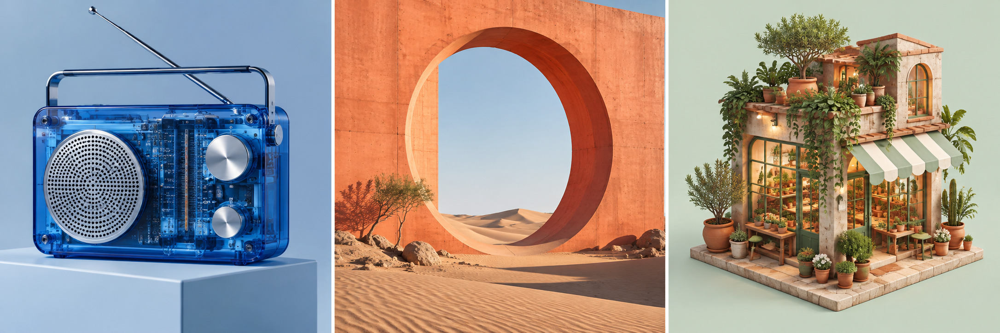

# Awesome Image 2.5

**GPT Image 2.5 prompt gallery, agent skills, and a generation / editing CLI.**

[中文](README.md) · [Prompt gallery](skills/image25/references/gallery.md) · [Quick start](docs/getting-started.md)



Visual examples with full prompts · Editing comparisons · 2 installable skills · Flare + Sunburst

[Original outputs and editing comparisons](docs/showcase.md) include complete prompts and provenance. The host did not expose their exact model identity; these are not verified Flare/Sunburst runs.

Download the repository and open `docs/gallery.html` for a searchable real-output gallery. Use `image25 catalog --kind original` to search from the CLI, `image25 --recipe chinese-poster --dry-run` to inspect a recipe request, and `image25 batch examples/batch.json --dry-run` to validate a batch. [Community sources](docs/community.md) · [Workflows](docs/workflows.md)

## Use it your way

- **Prompts:** browse the gallery and copy a recipe into your image tool.
- **Agents:** install `skills/image25` for generation/editing or `skills/image25-reverse-prompt` for visual prompt extraction.
- **CLI:** install from GitHub and use the official Images API.

```sh
uv tool install git+https://github.com/Fangx-AI/awesome-image2.5
image25 -p "A translucent cobalt-blue portable radio, studio photography" --dry-run
image25 -p "A translucent cobalt-blue portable radio, studio photography" --model flare -o generated/radio.png
image25 -p "Add a mustard scarf; preserve the pet and scene" --model sunburst -i pet.png -o generated/pet-edit.png
```

Live API calls require OPENAI_API_KEY in your environment. Each request produces one image and a JSON record. Existing files are never overwritten. There are no automatic retries.

## Model support

The CLI uses `gpt-image-2.5-flare` and `gpt-image-2.5-sunburst`, not an assumed `gpt-image-2.5` alias. It supports generation, multiple edit references, masks, quality selection and transparent PNG/WebP output. [API notes and official sources](skills/image25/references/api.md).

## Gallery status

Recipes are original and labelled **prompt-only**, not benchmarked model outputs. The cover is an original concept render; its host did not expose an exact model identifier. See [provenance](assets/PROVENANCE.md). Automated tests exercise the CLI with mocked API responses; they do not prove live account access.

Inspired by the gallery + skills + CLI format of [wuyoscar/GPT-Image2-Skill](https://github.com/wuyoscar/GPT-Image2-Skill). This implementation and these prompts were written for this repository; upstream images and source code are not copied.

[Contributing](CONTRIBUTING.md) · [CC0 license](LICENSE). Independent community project, not an official OpenAI product.
