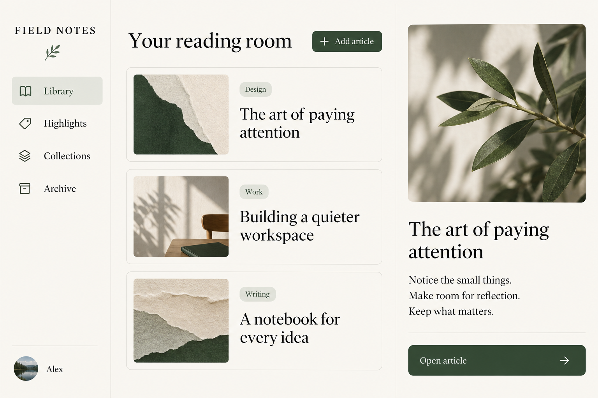
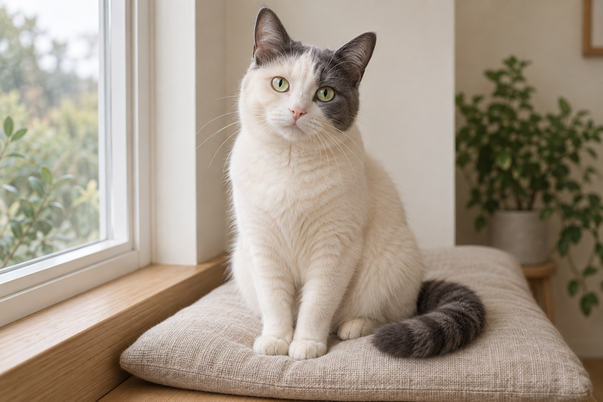
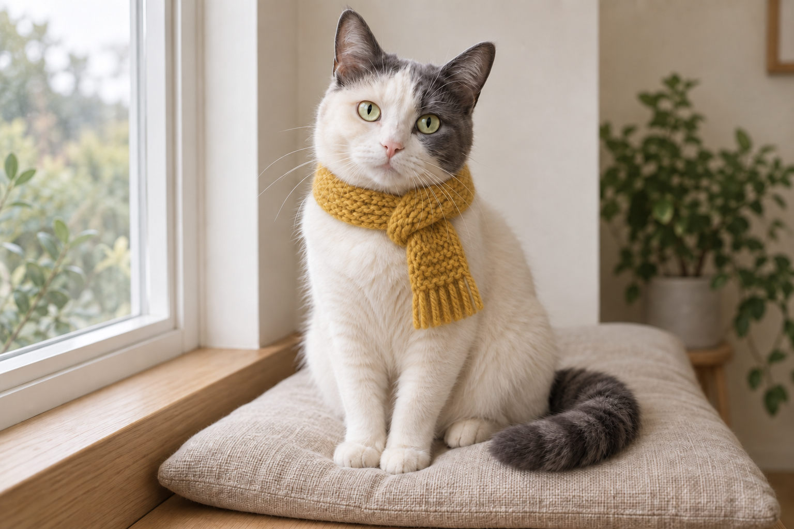

<div align="center">

# Awesome Image 2.5

**从可复制的提示词，到能检查结果的图像工作流。**

GPT Image 2.5 · 中文创作 · 图像编辑 · Agent Skills · CLI

[实图与前后对比](docs/showcase.md) · [分类案例](skills/image25/references/gallery.md) · [快速开始](docs/getting-started.md) · [English](README.en.md)


</div>

## 先看结果

| 中文商业广告 | 阅读工作台 |
| --- | --- |
|  |  |
| [完整提示词](assets/showcase/tea-campaign.txt) | [完整提示词](assets/showcase/field-notes-ui.txt) |

| 编辑前 | 编辑后：增加围巾 |
| --- | --- |
|  |  |

**实图附带完整提示词、输入关系和检查记录。** 这 6 张原创输出来自 Codex 内置生图工具，工具未提供精确模型 ID，因此没有标为指定 Image 2.5 模型实测。也记录风格偏移、细节变化等实际不足。[查看完整案例 →](docs/showcase.md)

## 你能用它做什么

| 任务 | 入口 |
| --- | --- |
| 搜索、筛选、复制或下载提示词 | [搜索画廊 HTML](docs/gallery.html)（下载仓库后直接打开） |
| 按摄影、设计、角色、教育、编辑等场景浏览 | [24 类提示词目录](skills/image25/references/gallery.md) |
| 从产品图到广告，或从海报到样机 | [7 组完整工作流](docs/workflows.md) |
| 让 Agent 帮你构思、出图和修改 | [Image 2.5 Skill](skills/image25/SKILL.md) |
| 从参考图片提炼提示词 | [Reverse Prompt Skill](skills/image25-reverse-prompt/SKILL.md) |
| 使用官方 API，保存提示词和参数记录 | [CLI 安装](docs/getting-started.md) |
| 查阅社区实测及原始出处 | [社区来源](docs/community.md) |

提示词库包含 **132 个基础场景和 1,080 个明确标注的任务侧重变体**。变体共享场景，不计作独立案例；提示词总数不等于实测图片数。搜索页默认展示基础场景。支持 JSON、JSONL、CSV 导出。

## 搜索与批量运行

```sh
image25 catalog "海报" --kind original
image25 catalog --show chinese-poster
image25 --recipe chinese-poster --dry-run
image25 --recipe chinese-poster --model flare -o poster.png
image25 batch examples/batch.json --dry-run
```

目录搜索无需 API Key。实际生成需要配置本机 OPENAI_API_KEY。批量任务先整体预检，再顺序运行，失败即停。[质量标准](docs/quality.md) · [故障排查](docs/troubleshooting.md)


## 安装 Skill

在 Codex 中使用内置安装器，分别提供需要的 Skill 文件夹链接：

```text
$skill-installer
安装 https://github.com/Fangx-AI/awesome-image2.5/tree/main/skills/image25
```

```text
$skill-installer
安装 https://github.com/Fangx-AI/awesome-image2.5/tree/main/skills/image25-reverse-prompt
```

其他支持 Agent Skills 的运行时，可将相应完整文件夹放入其文档指定的 skills 目录。不要覆盖已有同名 Skill。Skill 的安装与 CLI 安装相互独立。

安装后可以这样说：

```text
用 $image25 帮我生成一张“城市微光”中文海报。
用 $image25 给这张产品图换背景，保持产品形状和文字。
用 $image25-reverse-prompt 分析这张参考图，提炼中文提示词。
```

## CLI 快速开始

需要 Python 3.10+ 和 uv。先安装工具，再通过本机环境变量配置 OPENAI_API_KEY。

```sh
uv tool install git+https://github.com/Fangx-AI/awesome-image2.5
```

先检查请求，不调用 API：

```sh
image25 -p "A translucent cobalt-blue radio, studio photography" --model flare --dry-run
```

文生图：

```sh
image25 -p "A translucent cobalt-blue radio, studio photography" --model flare --size 1536x1024 -o generated/radio.png
```

参考图编辑：

```sh
image25 -p "Add a mustard scarf. Preserve the pet and background." --model sunburst -i pet.png -o generated/pet-edit.png
```

透明背景：

```sh
image25 -p "A tiny ceramic fox, isolated" --background transparent -o generated/fox.png
```

[更多用法：多图合成、蒙版、提示词文件、参数与故障排查 →](docs/getting-started.md)

每次调用生成 1 张图，并保存提示词、模型和参数的 JSON 记录。CLI 不覆盖现有文件、不自动重试，也不读取其他目录里的密钥文件。

## Image 2.5 模型

| CLI 选项 | 实际模型标识 | 官方定位 |
| :--- | :--- | :--- |
| `--model flare`（默认） | `gpt-image-2.5-flare` | 日常高质量图像生成，侧重速度 |
| `--model sunburst` | `gpt-image-2.5-sunburst` | 图像生成与编辑，侧重编辑精度 |

质量选项：`auto / low / medium / high / xhigh / max`。

核验日期：2026-09-09。来源：[Flare](https://developers.openai.com/api/docs/models/gpt-image-2.5-flare)、[Sunburst](https://developers.openai.com/api/docs/models/gpt-image-2.5-sunburst)、[图像生成指南](https://developers.openai.com/api/docs/guides/image-generation)。

## 开发与验证

```sh
git clone https://github.com/Fangx-AI/awesome-image2.5.git
cd awesome-image2.5
uv sync
uv run python -m unittest discover -s tests -v
```

自动化测试使用模拟响应，覆盖请求路由、模型参数、参考图顺序、蒙版校验、输出保存及失败清理。尚未通过本仓库 CLI 发起真实付费生图请求。

## 致谢与贡献

项目形态参考 [wuyoscar/GPT-Image2-Skill](https://github.com/wuyoscar/GPT-Image2-Skill) 的「画廊 + Skills + CLI」组织方式。本仓库的提示词与实现独立编写，未复制其代码或示例图片。

欢迎提交附带模型、提示词、参数和来源的真实 Image 2.5 案例，详见 [贡献指南](CONTRIBUTING.md)。

原创代码与文档采用 [CC0 1.0](LICENSE)。第三方内容遵循原许可。本项目由社区维护，与 OpenAI 无官方关联。
