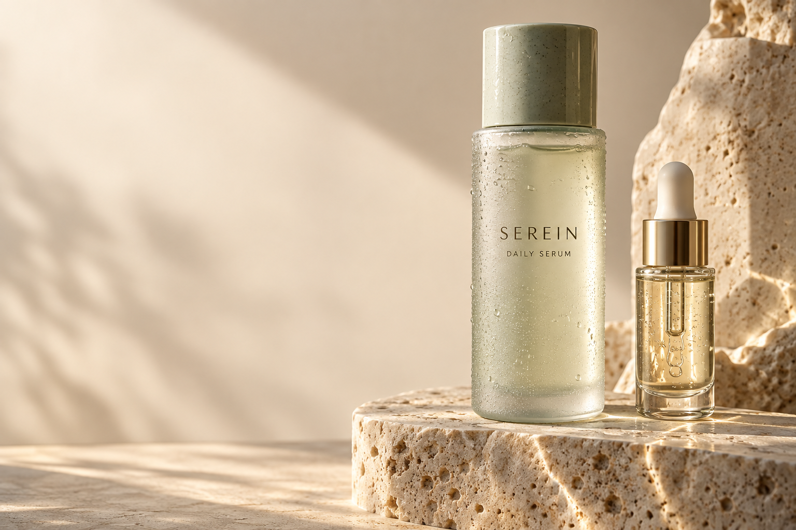
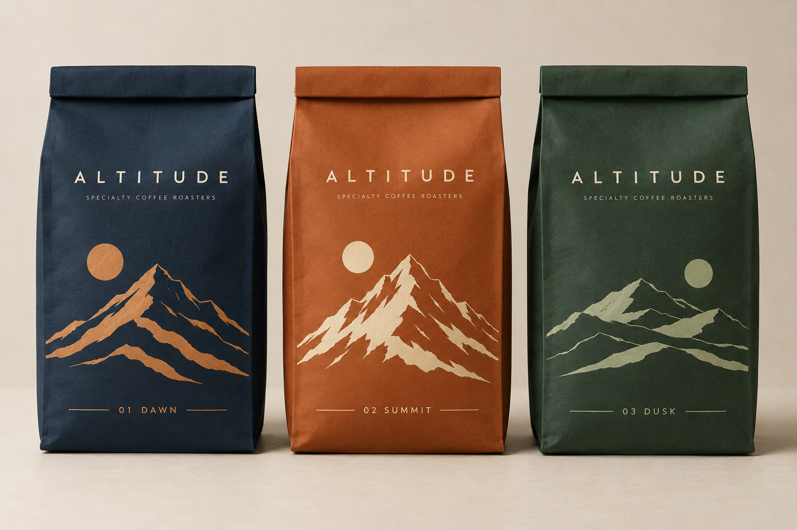
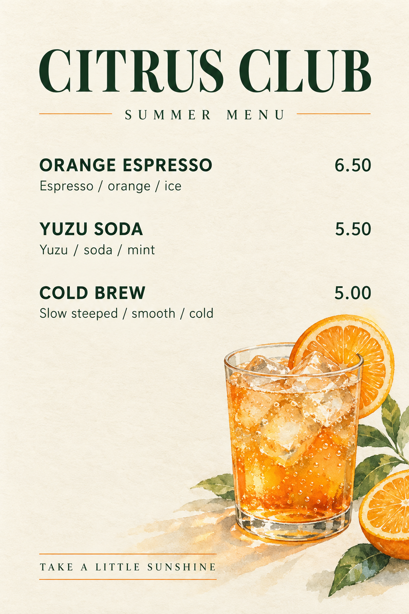
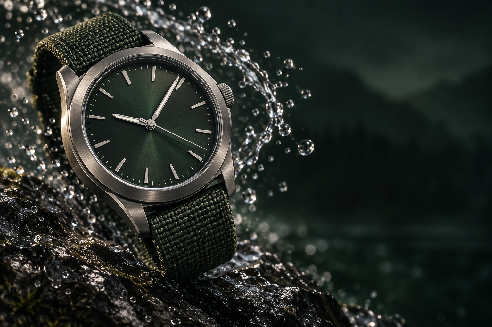
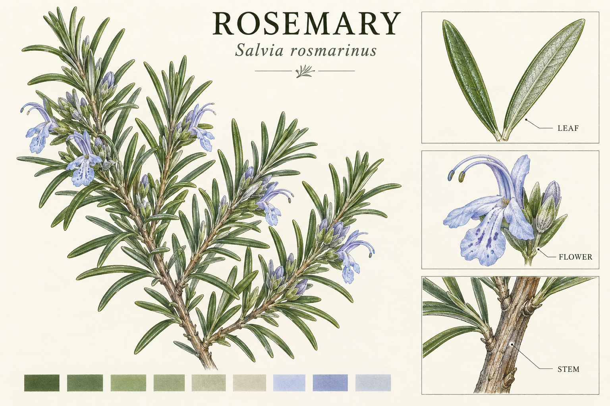
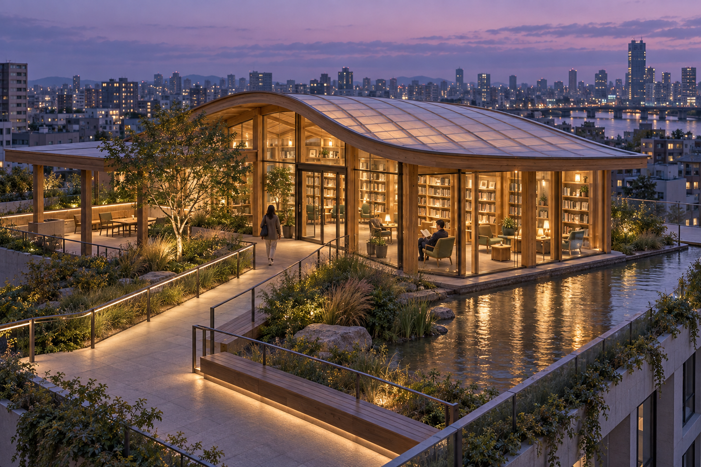
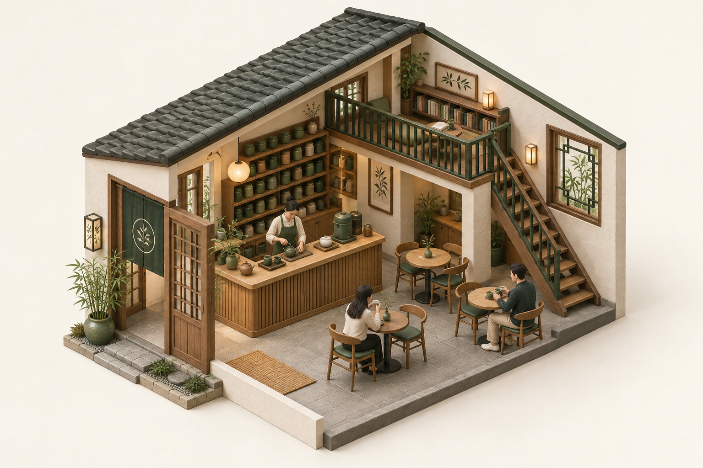
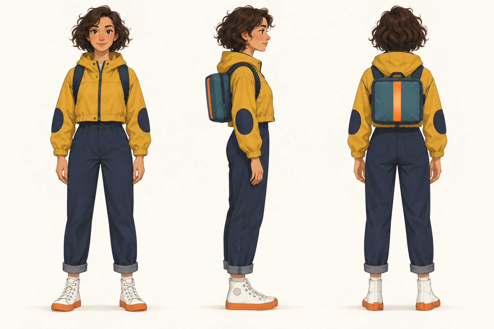
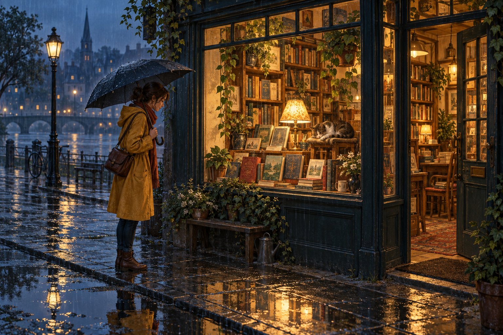

<h1 align="center">Awesome Image 2.5</h1>

看图选方向 · 展开提示词 · 换成你的内容 · 生成与修改

[English](../README.en.md) · [可搜索实图画廊](gallery.html) · [安装与使用](#安装与使用) · [社区来源](community.md)

## 画廊导航

| 分类 | 内容 |
| --- | --- |
| [商业设计](#commercial) | 护肤精华 · 咖啡包装 · 餐饮菜单 · 户外腕表 · 山间冷泡 · 平面海报 → 灯箱样机 |
| [宠物身份与局部编辑](#editing) | 一只猫的肖像 · 局部编辑：只增加围巾 |
| [图鉴与信息设计](#education) | 植物图鉴 |
| [建筑与微缩空间](#architecture) | 屋顶图书馆 · 等距茶馆 |
| [角色三视图](#character) | 快递员角色 |
| [界面设计](#interface) | FIELD NOTES |
| [叙事与风格偏差](#story) | 雨夜书店 |

本页仅展示实际生成的图片。每个案例包含完整提示词、适用任务、可替换内容及检查要点。宿主未返回精确模型 ID，生成记录统一标注 host-model-unknown；不把这些图片当作指定 Flare / Sunburst 的测试证据。

## 商业设计

| 护肤精华 · 材质与留白 | 咖啡包装 · 系列一致性 |
| --- | --- |
|  |  |

| 餐饮菜单 · 信息层级 | 户外腕表 · 动态广告 |
| --- | --- |
|  |  |

| 山间冷泡 · 产品广告 | 平面海报 → 灯箱样机 |
| --- | --- |
|  |  |

### 护肤精华 · 材质与留白

**适用：** 电商详情页首屏、护肤品牌 KV、材质研究

**写法拆解：** 将材质、光线、产品位置和文案留白拆开描述，减少主体与版面争抢空间。

**换成你的内容：** 替换品牌名、容器形状和主色；保留主体靠右与左侧留白关系。

**检查与局限：** 逐字检查瓶身文字；查看滴管、瓶盖、接触阴影与玻璃边缘。

完整提示词与复现命令

~~~text
Create a premium skincare campaign photograph in landscape 3:2. One tall frosted sea-glass serum bottle with a pale sage ceramic cap, a smaller translucent glass dropper beside it, standing on a sculptural ivory travertine plinth. Bottle label contains exactly two lines: 'SEREIN' and 'DAILY SERUM'. Macro-realistic condensation, believable translucent liquid, soft caustic light on the stone. Art direction: warm ivory background, sage and pale gold, long late-afternoon side light, restrained luxury editorial photography. Product occupies right 60 percent, left 40 percent is calm unbroken negative space for future layout, with no added text there. Camera at bottle mid-height, controlled perspective, physically plausible reflections. No extra logos, hands, flowers, watermark, invented ingredients, medical claims or tiny illegible text.
~~~

以下是官方 API 复现用法，实际结果可能不同；本页展示由宿主内置工具生成。

~~~sh
image25 --prompt-file assets/showcase/ceramic-skincare.txt --model flare -o generated/ceramic-skincare.png
~~~

[下载提示词](../assets/showcase/ceramic-skincare.txt) · [来源与生成记录](../assets/showcase/ceramic-skincare.json)

### 咖啡包装 · 系列一致性

**适用：** 咖啡品牌提案、系列包装方向探索

**写法拆解：** 先锁定袋型、文字位置与尺度，再允许配色和插画变化。

**换成你的内容：** 同时替换三款名称及风味色，保留同一版式系统。

**检查与局限：** 三袋版式和配色系统清楚，但模型额外加入了 SPECIALTY COFFEE ROASTERS 小字，未完全遵循只使用指定文字的要求。不是印刷刀模。

完整提示词与复现命令

~~~text
Create a sophisticated brand packaging presentation for a fictional coffee roaster named 'ALTITUDE'. Landscape 3:2, three upright matte paper coffee bags aligned on one warm ivory studio surface, equal shape and scale, realistic folded tops and bottom gussets. Each bag carries the same crisp ALTITUDE wordmark at the same position and a different bold minimal abstract mountain illustration. Left bag deep midnight blue with copper illustration and the readable label '01 DAWN'; middle warm burnt orange with cream illustration and '02 SUMMIT'; right muted forest green with pale sage illustration and '03 DUSK'. Consistent graphic system, disciplined hierarchy, tactile uncoated paper, delicate natural shadows, premium contemporary graphic design, photographed almost straight-on. Nothing overlaps text. No cups, beans, decorative objects, extra labels, claims or watermark. Make this a convincing coordinated packaging design, not three unrelated styles.
~~~

以下是官方 API 复现用法，实际结果可能不同；本页展示由宿主内置工具生成。

~~~sh
image25 --prompt-file assets/showcase/coffee-packaging.txt --model flare -o generated/coffee-packaging.png
~~~

[下载提示词](../assets/showcase/coffee-packaging.txt) · [来源与生成记录](../assets/showcase/coffee-packaging.json)

### 餐饮菜单 · 信息层级

**适用：** 咖啡馆季节菜单、餐饮视觉提案

**写法拆解：** 把所有文字写成明确清单，并指定价格对齐与插画区域。

**换成你的内容：** 替换品名和价格，控制菜单条目数量，避免加入过长说明。

**检查与局限：** 本次输出三项品名、价格、说明及页脚均与提示词对应；正式发布前仍需按原图尺寸逐字校对。

完整提示词与复现命令

~~~text
Design a refined single-page summer cafe menu as a flat full-bleed graphic design, portrait 2:3, not a photographed paper mockup. Warm ivory paper texture, deep forest-green typography, small orange accent rules. At top exact title 'CITRUS CLUB', below 'SUMMER MENU'. Right bottom quadrant contains one beautifully painted watercolor illustration of a sparkling orange drink with ice and a slice of orange, with plenty of clear space around the text. Three left-aligned menu entries with right-aligned prices in a clear generous grid: 'ORANGE ESPRESSO' price '6.50', next line smaller 'Espresso / orange / ice'; 'YUZU SODA' price '5.50', next line smaller 'Yuzu / soda / mint'; 'COLD BREW' price '5.00', next line smaller 'Slow steeped / smooth / cold'. Footer exact 'TAKE A LITTLE SUNSHINE'. Sophisticated serif headline, readable sans-serif menu labels, careful spacing, editorial restraint. Reproduce only the specified English text, no extra items, no logos, no watermark.
~~~

以下是官方 API 复现用法，实际结果可能不同；本页展示由宿主内置工具生成。

~~~sh
image25 --prompt-file assets/showcase/citrus-menu.txt --model flare -o generated/citrus-menu.png
~~~

[下载提示词](../assets/showcase/citrus-menu.txt) · [来源与生成记录](../assets/showcase/citrus-menu.json)

### 户外腕表 · 动态广告

**适用：** 户外用品广告、腕表氛围 KV

**写法拆解：** 明确产品结构约束，并给动态水滴划定空间，避免特效吞没主体。

**换成你的内容：** 替换表壳材质、表带色和背景，保留表盘结构约束。

**检查与局限：** 表盘清楚，表带与表壳连接可读，右侧留白形成；悬浮动作不明显，结果更接近靠近岩石的静物广告。

完整提示词与复现命令

~~~text
Create a striking luxury outdoor watch advertising photograph in landscape 3:2. A single unbranded brushed-titanium analog wristwatch with dark green woven strap floats diagonally above a wet black slate rock. The face has simple baton indices, three hands and no lettering, no subdials or date. A controlled arc of crystalline water droplets sweeps behind the watch without obscuring the face. Macro product photography with extremely sharp metal bevels, believable woven fabric, dark emerald background, narrow cool rim light and warm soft key light, tasteful motion and rich contrast. Watch occupies left two-thirds; right third remains dark quiet space for later copy. Strap connects correctly to both sides of the case, watch hands share one central axis, physically plausible watch construction. No typography, brand logo, extra watches, impossible duplicate straps, watermark or decorative symbols.
~~~

以下是官方 API 复现用法，实际结果可能不同；本页展示由宿主内置工具生成。

~~~sh
image25 --prompt-file assets/showcase/outdoor-watch.txt --model flare -o generated/outdoor-watch.png
~~~

[下载提示词](../assets/showcase/outdoor-watch.txt) · [来源与生成记录](../assets/showcase/outdoor-watch.json)

### 山间冷泡 · 产品广告

**适用：** 中文品牌广告、冷泡茶宣传

**写法拆解：** 限制中文字数与层级，将品牌、主标题和副标题分别指定。

**换成你的内容：** 替换产品与三处文字；标题尽量保持短句。

**检查与局限：** 主标题、副标题与瓶标逐字检查。

完整提示词与复现命令

~~~text
Create a finished premium vertical Chinese beverage campaign poster, aspect ratio 2:3. Original fictional tea brand 山间. A single elegant amber glass cold-brew tea bottle stands slightly right of center on a pale warm limestone block, with a small clear tea glass to the left and one fresh tea sprig resting low in the foreground. Bottle has a cream paper label with exactly two readable Chinese characters 山间 and a small blue-green square emblem. Upper left: beautifully typeset large Chinese headline exactly 慢下来，喝口茶 split into two balanced lines if needed. Under it, small subheading exactly 山间冷泡茶. No other text. Restrained palette of warm ivory, dark pine green and translucent amber. Late afternoon window light from upper left creates a geometric soft-edged shadow on the wall, authentic condensation, precise glass thickness, believable liquid refraction. Product label remains crisp and front-facing enough to read. Editorial typography with carefully controlled spacing, generous negative space, refined printed advertising aesthetic, exceptionally polished commercial art direction. Do not add certifications, statistics, tiny filler text, watermarks or unrelated objects.
~~~

以下是官方 API 复现用法，实际结果可能不同；本页展示由宿主内置工具生成。

~~~sh
image25 --prompt-file assets/showcase/tea-campaign.txt --model flare -o generated/tea-campaign.png
~~~

[下载提示词](../assets/showcase/tea-campaign.txt) · [来源与生成记录](../assets/showcase/tea-campaign.json)

### 平面海报 → 灯箱样机

**适用：** 提案中的投放场景样机

**写法拆解：** 先完成平面稿，再用参考图指定载体、视角与反射强度。

**换成你的内容：** 替换投放环境，保留参考图与完整画面要求。

**检查与局限：** 文字与图案可能重绘；不能作为像素保真贴图。

完整提示词与复现命令

~~~text
Use this exact Chinese tea campaign poster as the artwork inside a realistic vertical illuminated advertising lightbox in a refined contemporary transit-station interior. Preserve the complete original poster artwork including the exact headline 慢下来，喝口茶, the subheading 山间冷泡茶, the bottle label 山间, bottle, glass, tea leaves, relative layout and colors. Do not redesign, crop or rewrite the poster. Show the entire lightbox with a thin brushed-metal frame, photographed almost straight-on with slight environmental perspective. Neutral pale stone wall, clean tiled floor, warm soft overhead lighting and subtle glass reflections that do not obscure text. The poster is the dominant focus and fully readable. No people, transit logos, station names or other text. Landscape 3:2 composition with modest surrounding context.
~~~

以下是官方 API 复现用法，实际结果可能不同；本页展示由宿主内置工具生成。

~~~sh
image25 --prompt-file assets/showcase/tea-lightbox.txt -i assets/showcase/tea-campaign.png --model sunburst -o generated/tea-lightbox.png
~~~

[下载提示词](../assets/showcase/tea-lightbox.txt) · [来源与生成记录](../assets/showcase/tea-lightbox.json)

## 宠物身份与局部编辑

| 参考图 | 只增加围巾 |
| --- | --- |
|  |  |

### 一只猫的肖像 · 编辑基准图

**适用：** 宠物角色参考、身份保持实验

**写法拆解：** 用不对称面部花纹建立可观察的身份特征。

**换成你的内容：** 替换宠物类别及花纹；以实际出图作为下一步参考。

**检查与局限：** 耳部花纹与初始描述不完全一致。

完整提示词与复现命令

~~~text
Create a photorealistic editorial portrait of one fictional adult domestic cat, landscape 3:2. The cat has a distinctive asymmetrical face: mostly cream fur, a charcoal gray patch around its left eye (viewer right), both ears charcoal, pale green eyes, pink nose, cream chest and gray-striped tail curved on the cushion beside it. Sitting upright on a simple oatmeal linen cushion on a light oak window bench, front-facing head slightly angled toward the camera. Soft overcast daylight from the left, warm off-white wall behind, a gently out-of-focus green plant far in the background. Full cat ears, front paws and tail remain visible in frame. Natural fur detail, no over-sharpening, believable paws and whiskers, calm curious expression. No collar, clothing, accessories, text or watermark. This is an original fictional cat created as a reference for a subsequent controlled scarf edit; make its markings and scene clear and stable.
~~~

以下是官方 API 复现用法，实际结果可能不同；本页展示由宿主内置工具生成。

~~~sh
image25 --prompt-file assets/showcase/pet-portrait.txt --model flare -o generated/pet-portrait.png
~~~

[下载提示词](../assets/showcase/pet-portrait.txt) · [来源与生成记录](../assets/showcase/pet-portrait.json)

### 局部编辑：只增加围巾

**适用：** 增加配饰、局部产品展示

**写法拆解：** 明确只改哪一项，并逐项列出脸部、姿态和背景不变量。

**换成你的内容：** 将围巾替换成另一件配饰，保持一次只改一件事。

**检查与局限：** 目视身份相近，不代表背景与毛发逐像素保持。

完整提示词与复现命令

~~~text
Edit this exact cat photograph. Add only a small mustard-yellow knitted scarf wrapped naturally around the cat's neck, with a short loose end resting on the chest. Preserve the cat's exact facial identity, asymmetrical gray face patch, eye color, ears, whiskers, body shape, front paw position and curved tail. Preserve the window, cushion, plant, background, camera angle, crop and lighting. The scarf should be physically plausible with a soft contact shadow and visible knit texture. Do not change or beautify anything else. No text, collar or other accessories.
~~~

以下是官方 API 复现用法，实际结果可能不同；本页展示由宿主内置工具生成。

~~~sh
image25 --prompt-file assets/showcase/pet-scarf.txt -i assets/showcase/pet-portrait.png --model sunburst -o generated/pet-scarf.png
~~~

[下载提示词](../assets/showcase/pet-scarf.txt) · [来源与生成记录](../assets/showcase/pet-scarf.json)

## 图鉴与信息设计

### 植物图鉴 · 多面板信息

**适用：** 植物科普版式、博物馆图鉴视觉探索

**写法拆解：** 主图与局部细节分区，给每个面板限定一个内容与标签。

**换成你的内容：** 替换植物种类时同步修改局部细节描述与学名，避免仅替换标题。

**检查与局限：** 主图、三个细节框及标签齐全；植物结构尚未经专业核验，不能直接用作鉴定依据。

完整提示词与复现命令

~~~text
Create an exquisite botanical field-guide plate about the rosemary plant, landscape 3:2. Ivory archival paper, natural-history watercolor combined with precise fine ink linework, elegant readable editorial typography, orderly museum-book composition. Exact title 'ROSEMARY', subtitle 'Salvia rosmarinus'. Main left illustration: one large anatomically believable rosemary branch with narrow opposite needle-like green leaves, woody stem, and small pale blue flowers. Right column: three separately framed detail studies with exact labels 'LEAF', 'FLOWER', 'STEM'; a clearly enlarged leaf pair, a small blue flower closeup, and a woody stem detail respectively. Thin understated leader lines with no crossing, a balanced generous grid, small muted sage and blue color swatches along bottom without labels. No invented measurements, medicinal claims, additional paragraphs, garbled microtext or decorative stamps. The illustration should be detailed enough to inspire an educational design while keeping each panel immediately legible.
~~~

以下是官方 API 复现用法，实际结果可能不同；本页展示由宿主内置工具生成。

~~~sh
image25 --prompt-file assets/showcase/botanical-fieldguide.txt --model flare -o generated/botanical-fieldguide.png
~~~

[下载提示词](../assets/showcase/botanical-fieldguide.txt) · [来源与生成记录](../assets/showcase/botanical-fieldguide.json)

## 建筑与微缩空间

### 屋顶图书馆 · 空间叙事

**适用：** 社区建筑概念、屋顶公共空间提案

**写法拆解：** 同时描述入口、路径、使用区域和尺度参照，让空间具备可读的使用关系。

**换成你的内容：** 替换场地、材料与功能，保留动线和人尺度要求。

**检查与局限：** 入口路径、阅览区与屋顶花园关系可读；效果图不能证明结构、安全或无障碍合规。

完整提示词与复现命令

~~~text
Architectural visualization of a small public rooftop library at blue hour, landscape 3:2. A warm glowing timber-and-glass reading pavilion sits within a dense urban rooftop garden, with a gently curved translucent roof, fine timber ribs, floor-to-ceiling glass, visible bookshelves and several quiet reading nooks. A continuous accessible walkway connects the pavilion entrance to a sheltered terrace, shallow reflecting water along one edge, restrained native grasses and one small tree. Camera from an elevated three-quarter viewpoint, wide enough to understand the whole building and circulation. Background distant city softly recedes into a lavender sky. Warm interior lighting and cool exterior twilight, tactile stone and timber, physically credible structural members and glass reflections, refined architectural photography realism. Two small adult visitors for scale, no crowds, no words, no logos, no impossible floating columns. Clear distinction between circulation space and planting, plausible human scale, avoid generic futuristic megastructures.
~~~

以下是官方 API 复现用法，实际结果可能不同；本页展示由宿主内置工具生成。

~~~sh
image25 --prompt-file assets/showcase/rooftop-library.txt --model flare -o generated/rooftop-library.png
~~~

[下载提示词](../assets/showcase/rooftop-library.txt) · [来源与生成记录](../assets/showcase/rooftop-library.json)

### 等距茶馆 · 微缩场景

**适用：** 店铺概念插画、微缩空间、品牌内容

**写法拆解：** 用清楚的功能区与固定投影约束组织细节，避免只写等距风格。

**换成你的内容：** 替换店铺类型、材质与道具，维持出入口和通行空间。

**检查与局限：** 检查桌椅尺度、楼梯连接及人物数量；微缩风格不代表工程可施工。

完整提示词与复现命令

~~~text
Create a beautifully crafted isometric cutaway illustration of a tiny contemporary Chinese tea house, landscape 3:2 with the complete building centered and ample ivory negative space. Two visible interior sides, one open cutaway wall, consistent orthographic isometric geometry with no vanishing-point distortion. Warm oak service counter at front-left, one slim sage-green tea brewing station, precisely arranged ceramic cups, a wall of small tea tins at the rear, three intimate tables with chairs in the customer zone, one potted bamboo plant and a narrow staircase to a small reading mezzanine. A single adult tea maker behind the counter and two adult guests seated at separate tables. Soft handcrafted clay-and-paper model aesthetic, gentle warm studio lighting, miniature texture, restrained forest-green terracotta and cream palette. Windows and stairs physically coherent, chairs at table height, clear walking path from entrance to counter. No typography, labels, floating furniture, extra floors or cropped base.
~~~

以下是官方 API 复现用法，实际结果可能不同；本页展示由宿主内置工具生成。

~~~sh
image25 --prompt-file assets/showcase/isometric-teahouse.txt --model flare -o generated/isometric-teahouse.png
~~~

[下载提示词](../assets/showcase/isometric-teahouse.txt) · [来源与生成记录](../assets/showcase/isometric-teahouse.json)

## 角色三视图

### 快递员角色 · 三视图一致性

**适用：** 动画角色开发、三视图方向探索

**写法拆解：** 按服装部位逐项锁定跨视图不变量，并指定相同基线与尺度。

**换成你的内容：** 替换角色职业与服装颜色，保持三视图布局和服装结构清单。

**检查与局限：** 三视图的主色、背包、裤脚与鞋底基本呼应；正面肘部补丁的位置偏外，侧面背包厚度仍需人工定稿。

完整提示词与复现命令

~~~text
A polished animation character model sheet, landscape 3:2, on a clean warm off-white background. Exactly three equal-scale full-body views of the same adult female bicycle courier: front view, strict side profile facing right, and back view, aligned along a single baseline and generously separated. She has a short curly dark-brown bob, a mustard yellow cropped rain jacket with dark navy elbow patches, navy cuffed trousers, white high-top sneakers with orange soles, and a small square teal delivery backpack with one centered orange reflective strip. All three views must preserve the identical jacket construction, sleeve length, trouser cuffs, shoe design, backpack proportions and colors. Relaxed neutral standing pose, hands visible at sides, no bicycle or props. Stylish hand-painted 2D animation development art, expressive but restrained proportions, clear readable silhouettes, subtle soft shading, no photorealism, no labels, no arrows, no extra views, no cropped feet.
~~~

以下是官方 API 复现用法，实际结果可能不同；本页展示由宿主内置工具生成。

~~~sh
image25 --prompt-file assets/showcase/courier-character.txt --model flare -o generated/courier-character.png
~~~

[下载提示词](../assets/showcase/courier-character.txt) · [来源与生成记录](../assets/showcase/courier-character.json)

## 界面设计

### FIELD NOTES · 阅读工作台

**适用：** 阅读应用视觉方向、产品方案沟通

**写法拆解：** 先定义分区与信息层级，再指定组件及文字。

**换成你的内容：** 替换栏目、卡片内容和品牌色，保留阅读主区。

**检查与局限：** 这是图像概念，交互、响应式和可访问性须在实现中验证。

完整提示词与复现命令

~~~text
Create a highly polished desktop app interface design mockup for an original reading and knowledge application named FIELD NOTES, landscape 3:2. This is a fictional UI concept, use only the exact text strings provided. Straight-on full application canvas with no device frame or perspective. Warm off-white background, ink black typography, forest green accent, thin warm gray separators, generous spacing, elegant editorial design. Three clear columns: narrow left navigation, main reading list, right reading preview. Top left wordmark FIELD NOTES. Left navigation text Library, Highlights, Collections, Archive. Main heading Your reading room with small button Add article. Three carefully designed article cards with abstract paper-texture thumbnails, headlines The art of paying attention; Building a quieter workspace; A notebook for every idea. Small category pills Design, Work, Writing. Right preview panel shows a large botanical photograph-style thumbnail then heading The art of paying attention, followed by three short readable lines exactly: Notice the small things. Make room for reflection. Keep what matters. Bottom right button Open article. At bottom left a compact user avatar with label Alex. Consistent baseline grid, crisp legible text, aligned cards and icons, thoughtful visual hierarchy, no meaningless placeholder paragraph text, no charts, fake metrics, watermarks or extraneous copy. Make it feel like an exceptionally well-crafted editorial software interface.
~~~

以下是官方 API 复现用法，实际结果可能不同；本页展示由宿主内置工具生成。

~~~sh
image25 --prompt-file assets/showcase/field-notes-ui.txt --model flare -o generated/field-notes-ui.png
~~~

[下载提示词](../assets/showcase/field-notes-ui.txt) · [来源与生成记录](../assets/showcase/field-notes-ui.json)

## 叙事与风格偏差

### 雨夜书店 · 叙事插画

**适用：** 故事场景、电影氛围探索

**写法拆解：** 使用冷暖分区和人物动作建立叙事，而不是堆叠画质形容词。

**换成你的内容：** 替换店铺与主角，保留光源位置及前后景。

**检查与局限：** 本次输出偏写实，未达到二维绘画要求，作为偏差案例展示。

完整提示词与复现命令

~~~text
Create an original richly detailed cinematic editorial illustration in landscape 3:2. A tiny independent bookshop on a quiet rainy street at blue hour. The shop occupies the right two-thirds; a single original adult character in a mustard raincoat stands on the left under an umbrella, leaning slightly toward a warm window display. Inside the window: neatly layered books, one small lamp, a cat curled on a stool, a few leafy plants. No readable signage or text anywhere. Painted 2D illustration with fine controlled linework, subtle paper grain and expressive but restrained brush edges, clearly not a photograph or generic 3D render. Strong contrast between warm amber interior and deep teal rainy exterior. Wet pavement reflects only the light sources actually present. Rain is fine and understated. Clear foreground puddle, midground person and shop, background quiet silhouettes. Carefully observed perspective, convincing umbrella grip, visible character silhouette, intimate human scale. Mood: a place to slow down and feel at home. Sophisticated art direction, excellent composition, narrative detail without visual clutter. No existing characters, logos or watermarks.
~~~

以下是官方 API 复现用法，实际结果可能不同；本页展示由宿主内置工具生成。

~~~sh
image25 --prompt-file assets/showcase/rainy-bookshop.txt --model flare -o generated/rainy-bookshop.png
~~~

[下载提示词](../assets/showcase/rainy-bookshop.txt) · [来源与生成记录](../assets/showcase/rainy-bookshop.json)

## 安装与使用

~~~sh
uv tool install git+https://github.com/Fangx-AI/awesome-image2.5
~~~

在 Codex 中通过 $skill-installer 安装 [image25](../skills/image25) 或 [image25-reverse-prompt](../skills/image25-reverse-prompt)。
安装后直接描述目标，例如“用 image25 参考系列咖啡包装，改成三款茶叶包装，保持统一版式”。

[快速开始](getting-started.md) · [工作流](workflows.md) · [质量标准](quality.md) · [故障排查](troubleshooting.md)

## 提示词实验区

[基础场景与变体目录](../skills/image25/references/gallery.md)用于探索未出图的构思，不列入精选画廊。条目数量不代表作品数量。

## 来源与贡献

组织方式学习自 [wuyoscar/GPT-Image2-Skill](https://github.com/wuyoscar/GPT-Image2-Skill)。本页图像与提示词为独立创作。
欢迎提交包含效果图、完整提示词、参考图、模型依据和出处的案例。详见 [贡献指南](../CONTRIBUTING.md)。原创内容采用 [CC0](../LICENSE)，第三方内容遵循原许可。社区项目，与 OpenAI 无官方关联。
